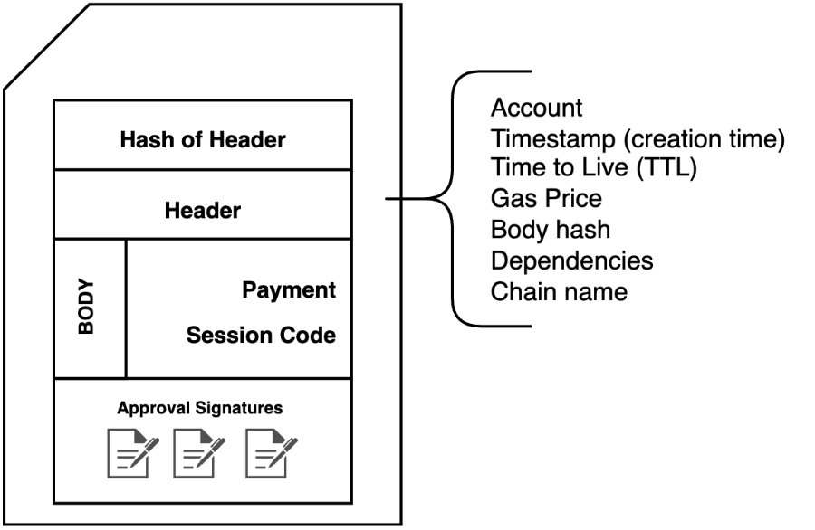

# Transactions and the Transaction Lifecycle

## Transactions {#execution-semantics-transactions}

A [transaction](./glossary/T.md#transaction) is a data structure containing Wasm and the requester's signature(s). Additionally, the transaction header contains additional metadata about the transaction itself. A transactions’s structure is as follows:

- Body: Containing payment code and session code (more details on these below)
- Header: containing
    - The [Public Key](./serialization/types.md#publickey) of the account in whose context the transaction will run
    - The timestamp of the transaction’s creation
    - A time-to-live, after which the transaction expires and cannot be included in a block
    - the `blake2b256` hash of the body
- Transaction hash: the `blake2b` hash of the Header
- Approvals: the set of signatures which have signed the transaction hash; these are used in the [account permissions model](./design/casper-design.md#accounts-associated-keys-weights)

## The Transaction Lifecycle {#execution-semantics-phases}

A transaction goes through the following phases on Casper:

1. Transaction Received
2. Transaction Gossiped
3. Block Proposed
4. Block Gossiped
5. Consensus Reached
6. Transaction Executed

### Transaction Received

A client sending the transaction will send it to one or more nodes via their JSON RPC servers. The node will ensure that a given transaction matches configuration settings outlined in the network's chainspec. Transaction configuration for the Casper Mainnet can be found [here](https://github.com/casper-network/casper-node/blob/dev/resources/production/chainspec.toml#L79). Once accepted, the system returns the transaction hash to the client to indicate it has been enqueued for execution. The transaction could expire while waiting to be gossiped; whenever this happens, a `TransactionExpired` event is emitted by the event stream servers of all nodes which have the expired transaction.

### Transaction Gossiped

After a node accepts a new transaction, it will gossip to all other nodes. A validator node will put the transaction into the block proposer buffer. The validator leader will pick the transaction from the block proposer buffer to create a new proposed block for the chain. This mechanism is efficient and ensures all nodes in the network eventually hold the given transaction. Each node that accepts a gossiped transaction also emits a `TransactionAccepted` event on its event stream server. The transaction may expire while waiting for a node to add it to the block. Whenever this happens, the node emits a `TransactionExpired` event.

### Block Proposed

The validator leader for this round will propose a block that includes as many transactions from the block proposer buffer as can fit in a block.

### Block Gossiped

The proposed block propagates to all other nodes.

### Consensus Reached

Once the other validators reach consensus that the proposed block is valid, all transactions in the block are executed, and this block becomes the final block added to the chain. Whenever reaching consensus, the event stream server emits a `BlockAdded`. `FinalitySignature` events emit shortly after that. Finality signatures for the new block arrive from the validators.

### Transaction Executed

A transaction executes in distinct phases to accommodate flexibly paying for computation. The phases of a transaction are *payment*, *session*, and *finalization*. Payment code executes during the payment phase. If it is successful, the session code executes during the session phase. And, independently of session code execution, the finalization phase does some bookkeeping around the payment. Once the transaction is executed, a `TransactionProcessed` event is emitted by the event stream server.

In the event of execution failure, the sender will be charged the minimum penalty payment - 2.5 CSPR on the Casper Mainnet. This prevents malicious spamming of faulty transactions.

**Payment code**

_Payment code_ determines the payment amount for the computation requested and how much the sender is willing to pay. Payment code may include arbitrary logic, providing flexibility in paying for a transaction. For example, the simplest payment code could use the account entity's [main purse](./design/casper-design.md#tokens-purses-and-accounts). In contrast, an enterprise application may require a multi-signature scheme that accesses a corporate purse. To ensure the payment code will pay for its own computation, only entities with a balance in their main purse greater than or equal to `MAX_PAYMENT_COST` may execute transactions. Based on the current conversion rate between gas and motes, we restrict the gas limit of the payment code execution so that the process spends no more than `MAX_PAYMENT_COST` motes (a constant of the system.)
If the payment is absent or not enough, then payment execution is not successful. In this case, the effects of the payment code on global state are reverted, and the system covers the cost of the computation with motes taken from the offending entity's main purse.

**Session code**

_Session code_ provides the main logic for the transaction. It only executes if the payment code is successful. The gas limit for this computation is determined based on the amount of payment given (after subtracting the cost of the payment code itself).

**Specifying payment code and session code**

The user-defined logic of a transaction can be specified in a number of ways:

- a Wasm module in binary format representing valid session code, including logic to be executed in the context of an account entity or to store Wasm in the form of a contract to be executed later. (Note that the named keys from the context of the entity the transaction is running in.)
- a 32-byte identifier representing the [hash](./serialization/types.md#hash-key-serialization-standard-hash-key) where a contract is already stored in the global state
- a name corresponding to a named key, where a contract is stored under the key

Payment and session code can be independently specified, so different methods of specifying them may be used (e.g. payment could be specified by a hash key, while the session is explicitly provided as a Wasm module).