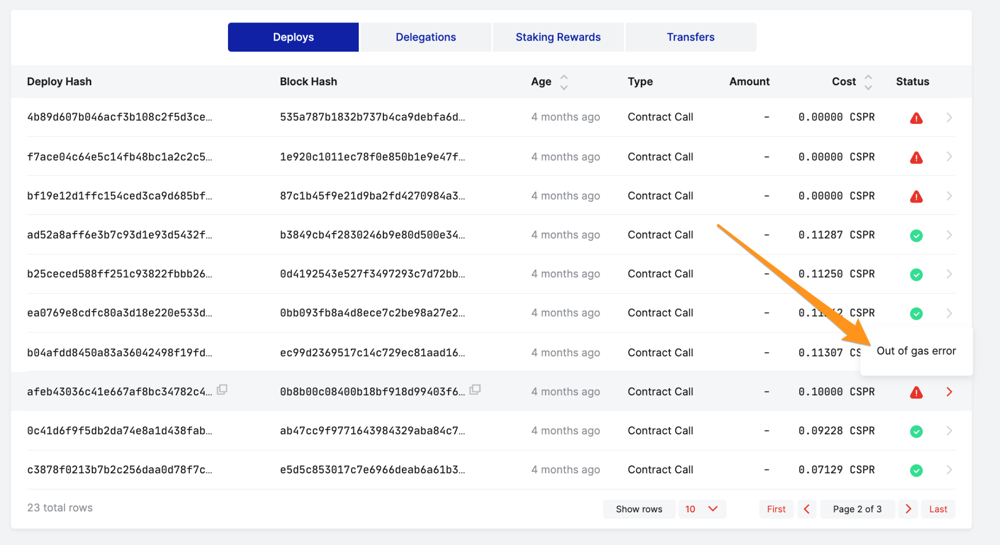
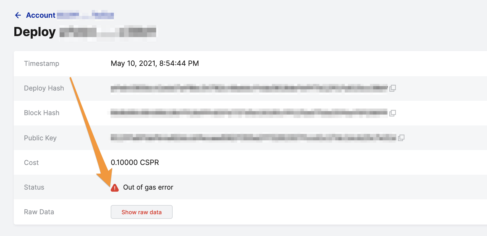
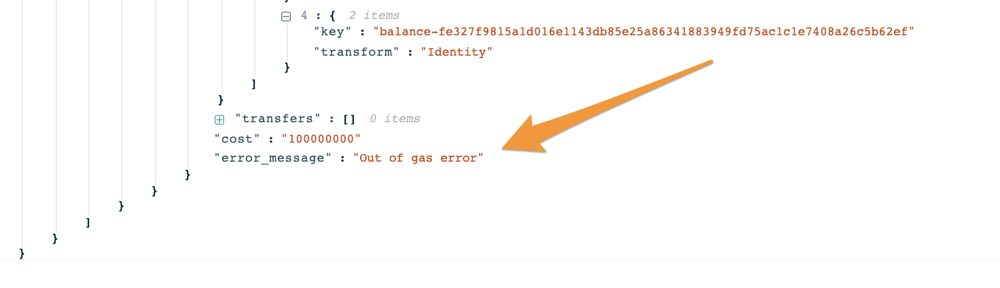

# Sending Transactions using the Casper Client

To install smart contracts on the blockchain, you can send your Wasm to the network via a [Transaction](../../concepts/glossary/T.md#transaction). To do this, you will need to meet a few prerequisites:

- You will need a client to interact with the network, such as the [default Casper client](../prerequisites.md#install-casper-client)
- Ensure you have an [Account](../prerequisites.md#setting-up-an-account) and its associated [keys](../../concepts/accounts-and-keys.md) This account will pay for the Transaction, and its secret key will sign the Transaction
- Ensure this account has enough CSPR tokens to pay for the Transaction

## Paying for Transactions {#paying-for-transactions}

CSPR tokens are used to pay for transactions on the Casper Mainnet and Testnet. There are several ways to fund your account:

- You may want to [transfer tokens from an exchange](../../users/funding-from-exchanges.md)
- You can use a [block explorer to transfer tokens](../../users/csprlive/token-transfer.md) between accounts' purses
- You can also [transfer tokens using the default Casper client](../cli/transfers/index.md)
- On the Testnet, you can use the [faucet functionality](../../users/csprlive/testnet-faucet.md) for testing your smart contracts
- If running a network locally using [NCTL](../dapps/nctl-test.md), the tool provides several funded accounts

## Monitoring the Event Stream for Transactions

If you want to follow the [lifecycle](../../concepts/transactions-and-transaction-lifecycle.md#execution-semantics-phases) of the Transaction, you can start monitoring a node's event stream. This section will focus only on TransactionAccepted events, but there are other event types described [here](../dapps/monitor-and-consume-events.md). You need the following information to proceed:

- The IP address of a [peer](../prerequisites.md#acquire-node-address-from-network-peers) on the network
- The port specified as the `event_stream_server.address` in the node's *config.toml*, which is by default 9999 on Mainnet and Testnet
- The URL for streamed events, which is <HOST:PORT>/events

With the following command, you can start watching the event stream. Note the event ID recorded when you send the Transaction in the next section.

```bash
curl -s http://65.21.235.219:9999/events
```

## Sending a Transaction to the Network {#sending-the-transaction}

You can call the Casper client's `put-txn` command to put the compiled contract on the chain. In this example, the Transaction will execute in the account's context. See the [advanced features](#advanced-features) section for key delegation.

```bash
casper-client put-txn session\
    --node-address <HOST:PORT> \
    --chain-name casper-net-1 \
    --transaction-path <transaction-PATH> \
    --session-entry-point <NAME> \
    --category <INSTALL-UPGRADE|LARGE|MEDIUM|SMALL> \
    --gas-price-tolerance <INTEGER> \
    --pricing-mode fixed \
    --secret-key <PATH> | --initiator-address <HEX STRING>
```

1. `node-address` - An IP address of a peer on the network. The default port of the sidecar's JSON-RPC server on Mainnet and Testnet is 7777. You can find a list of trusted peers in network's configuration file, `config.toml`. Here is an [example](https://github.com/casper-network/casper-node/blob/dev/resources/production/config-example.toml#L131). You may send transactions to one of the trusted nodes or use them to query other online nodes.
2. `chain-name` - The chain-name to the network where you wish to send the Transaction. For Mainnet, use *casper*. For Testnet, use *casper-test*. As you can see, this example uses the Testnet.
3. `transaction-path` - The path to the contract Wasm, which should point to wherever you compiled the contract (.wasm file) on your computer.
4. `session-entry-point` - Name of the method that will be used when calling the session contract.
5. `category` - The transaction category, based on size of the Wasm included. `install-upgrade` being the largest, descending in size through `large`, `medium` and `small`
6. `gas-price-tolerance` - The maximum gas price that the user is willing to pay for this transaction.
7. `pricing-mode` - The pricing mode used for this transaction, in this case `fixed`.
8. `secret-key` or `initiator-address` - The file name containing the secret key of the account paying for the Transaction, or the address of the account initiating the transaction. `initiator-address` can be a public key, account hash or an entity address.

The command will return a transaction hash, which is needed to verify the transaction's execution results. Sending the transaction and receiving the transaction hash does not mean the transaction was processed successfully. Therefore, you must check the transaction execution using the transaction hash. See the transaction lifecycle for more details.

**Note**: Each Transaction gets a unique hash, which is part of the cryptographic security of blockchain technology. No two transactions will ever return the same hash.

<details>
<summary>Sample put-txn result</summary>

```json
{
  "jsonrpc": "2.0",
  "id": 1294011212530641270,
  "result": {
    "api_version": "2.0.0",
    "transaction_hash": {
      "Version1": "efad4a969064b5f8189ea4d6dd2fba2926d01d583a35178c07d7b827de16789e"
    }
  }
}
```

</details>

Verify the transaction details with the `get-txn` command and the `transaction_hash` received above.

```bash
casper-client get-txn \
    --node-address <HOST:PORT> <TRANSACTION-HASH>
```

If the Transaction succeeded, the `get-txn` command would return a JSON object with the full transaction details.

<details>
<summary>Sample get-transaction result</summary>

```json

{
  "jsonrpc": "2.0",
  "id": -3929997047953574815,
  "result": {
    "api_version": "2.0.0",
    "transaction": {
      "Version1": {
        "hash": "efad4a969064b5f8189ea4d6dd2fba2926d01d583a35178c07d7b827de16789e",
        "header": {
          "chain_name": "casper-net-1",
          "timestamp": "2024-07-17T16:45:43.821Z",
          "ttl": "30m",
          "body_hash": "c5c4f7ae2fecb68937c19a1439eefddd8d4c32de779fe3ffee292977f161b234",
          "pricing_mode": {
            "Fixed": {
              "gas_price_tolerance": 10
            }
          },
          "initiator_addr": {
            "PublicKey": "01f4ed68f99591d583426d1700b9be6ebd34d8cd395710596bce3db8b127ea3f65"
          }
        },
        "body": {
          "args": [
            [
              "name",
              {
                "cl_type": "String",
                "bytes": "050000004345503138",
                "parsed": "CEP18"
              }
            ],
            [
              "symbol",
              {
                "cl_type": "String",
                "bytes": "0400000067726973",
                "parsed": "gris"
              }
            ],
            [
              "total_supply",
              {
                "cl_type": "U256",
                "bytes": "0164",
                "parsed": "100"
              }
            ],
            [
              "decimals",
              {
                "cl_type": "U8",
                "bytes": "01",
                "parsed": 1
              }
            ]
          ],
          "target": {
            "Session": {
              "module_bytes": "[655810 hex chars]",
              "runtime": "VmCasperV1"
            }
          },
          "entry_point": "Call",
          "transaction_category": 2,
          "scheduling": "Standard"
        },
        "approvals": [
          {
            "signer": "01f4ed68f99591d583426d1700b9be6ebd34d8cd395710596bce3db8b127ea3f65",
            "signature": "012ac4fc94d4ba269eb94aad1b9e90d1f701ed0e660995c1a15afc69010b74b51dd1334f9a59a9587aaf6aa6ab5ad35a7e86a9dcba39c2d21843e56d5d4014f00f"
          }
        ]
      }
    },
    "execution_info": {
      "block_hash": "23f21d3af261dd830790926b240dbded4362bb3c1183d9ee4ec1aea132bfa5e0",
      "block_height": 624,
      "execution_result": {
        "Version2": {
          "initiator": {
            "PublicKey": "01f4ed68f99591d583426d1700b9be6ebd34d8cd395710596bce3db8b127ea3f65"
          },
          "error_message": null,
          "limit": "1000000000000",
          "consumed": "371736413663",
          "cost": "1000000000000",
          "payment": [],
          "transfers": [],
          "size_estimate": 328238,
          "effects": [
            {
              "key": "balance-hold-014c3f3c8ae53f894ff181b1c2aaa7b5bbea5eb26b30c51887f8e4995a59e933b463f295c190010000",
              "kind": {
                "Write": {
                  "CLValue": {
                    "cl_type": "U512",
                    "bytes": "050010a5d4e8",
                    "parsed": "1000000000000"
                  }
                }
              }
            },
            {
              "key": "uref-4bb9770e4b7dfa5e9d12cfb35b55d862d6eebdced3205e422b48d7fb207b874d-000",
              "kind": {
                "Write": {
                  "CLValue": {
                    "cl_type": "String",
                    "bytes": "050000004345503138",
                    "parsed": "CEP18"
                  }
                }
              }
            },
            {
              "key": "uref-21a2ada35583cfe2a63c59a70d5df464f9bd90833c261871b44e9cf7f7d28c1a-000",
              "kind": {
                "Write": {
                  "CLValue": {
                    "cl_type": "String",
                    "bytes": "0400000067726973",
                    "parsed": "gris"
                  }
                }
              }
            },
            {
              "key": "uref-303ab2a4aeb6a057a7a256aabf491dad6f0decbfd880d80f9052d5b2df83ba5f-000",
              "kind": {
                "Write": {
                  "CLValue": {
                    "cl_type": "U8",
                    "bytes": "01",
                    "parsed": 1
                  }
                }
              }
            },
            {
              "key": "uref-456742d5cec63a743907e61935567da1c8f73f95c5aba2c84801189fce936ad1-000",
              "kind": {
                "Write": {
                  "CLValue": {
                    "cl_type": "U256",
                    "bytes": "0164",
                    "parsed": "100"
                  }
                }
              }
            },
            {
              "key": "uref-16baf770d6b97cfa6abe0017ea33f17efdc51236db3b2fa44052080282e19e03-000",
              "kind": {
                "Write": {
                  "CLValue": {
                    "cl_type": "U8",
                    "bytes": "00",
                    "parsed": 0
                  }
                }
              }
            },
            {
              "key": "uref-de4523d10773c2ee1fd48adb32d7121380c0febbf4f36f1029dc61ff079b83ce-000",
              "kind": {
                "Write": {
                  "CLValue": {
                    "cl_type": "U8",
                    "bytes": "00",
                    "parsed": 0
                  }
                }
              }
            },
            {
              "key": "uref-efcac4a17c93c5ba3d3213ea4a00631c5da3fb8bba36c70ae1431db6ea93b8b5-000",
              "kind": {
                "Write": {
                  "CLValue": {
                    "cl_type": "Unit",
                    "bytes": "",
                    "parsed": null
                  }
                }
              }
            },
            {
              "key": "package-dea470cf75f60abafcca7c68313f18fc2e21881d607ad75fa65e2bfe547da25c",
              "kind": {
                "Write": {
                  "Package": {
                    "versions": [],
                    "disabled_versions": [],
                    "groups": [],
                    "lock_status": "Unlocked"
                  }
                }
              }
            },
            {
              "key": "named-key-entity-account-b2ba71785a4e071a467a03c3a4d3ca827ce5319e4ca92d148e8bcb2142eb4b8e-987369d1ce9ffff037841f4a221d7fc63924d565196de9e67ea8bdb897bc22e7",
              "kind": {
                "Write": {
                  "NamedKey": {
                    "named_key": {
                      "cl_type": "Key",
                      "bytes": "10dea470cf75f60abafcca7c68313f18fc2e21881d607ad75fa65e2bfe547da25c",
                      "parsed": "package-dea470cf75f60abafcca7c68313f18fc2e21881d607ad75fa65e2bfe547da25c"
                    },
                    "name": {
                      "cl_type": "String",
                      "bytes": "1c00000063657031385f636f6e74726163745f7061636b6167655f4345503138",
                      "parsed": "cep18_contract_package_CEP18"
                    }
                  }
                }
              }
            },
            {
              "key": "named-key-entity-account-b2ba71785a4e071a467a03c3a4d3ca827ce5319e4ca92d148e8bcb2142eb4b8e-eb635428d8eb01ac5683a333755ba85f6299df45cab9048c18d84fbc5367e932",
              "kind": {
                "Write": {
                  "NamedKey": {
                    "named_key": {
                      "cl_type": "Key",
                      "bytes": "02efcac4a17c93c5ba3d3213ea4a00631c5da3fb8bba36c70ae1431db6ea93b8b507",
                      "parsed": "uref-efcac4a17c93c5ba3d3213ea4a00631c5da3fb8bba36c70ae1431db6ea93b8b5-007"
                    },
                    "name": {
                      "cl_type": "String",
                      "bytes": "2300000063657031385f636f6e74726163745f7061636b6167655f6163636573735f4345503138",
                      "parsed": "cep18_contract_package_access_CEP18"
                    }
                  }
                }
              }
            },
            {
              "key": "package-dea470cf75f60abafcca7c68313f18fc2e21881d607ad75fa65e2bfe547da25c",
              "kind": "Identity"
            },
            {
              "key": "entity-system-2aed4e1c6a7feaf307b16547e15e48e60c124abe2b93759f9b1d52ae052728ec",
              "kind": "Identity"
            },
            {
              "key": "package-1b937640b847113bb5adeccdd1aae96a913c340c1911949f90c90a0dd025d9a4",
              "kind": "Identity"
            },
            {
              "key": "entry-point-v1-entity-system-2aed4e1c6a7feaf307b16547e15e48e60c124abe2b93759f9b1d52ae052728ec-21bddc7e4379ba445c7118cb51962954e0d1e5aa5cacc0c4ff6095b57eb9fb33",
              "kind": "Identity"
            },
            {
              "key": "uref-4d2ab9ebd75542172d2d94e2c8ebc107e9354c362b9542fdb5c667cb937704fd-000",
              "kind": {
                "Write": {
                  "CLValue": {
                    "cl_type": "Unit",
                    "bytes": "",
                    "parsed": null
                  }
                }
              }
            },
            {
              "key": "balance-4d2ab9ebd75542172d2d94e2c8ebc107e9354c362b9542fdb5c667cb937704fd",
              "kind": {
                "Write": {
                  "CLValue": {
                    "cl_type": "U512",
                    "bytes": "00",
                    "parsed": "0"
                  }
                }
              }
            },
            {
              "key": "byte-code-v1-wasm-d1db7551d7b5e40760763d2e4e5a253a9c865ab4367e83341bca16548afd5bcd",
              "kind": {
                "Write": {
                  "ByteCode": {
                    "kind": "V1CasperWasm",
                    "bytes": "[659014 hex chars]"
                  }
                }
              }
            },
            {
              "key": "named-key-entity-contract-363996106630892a964565574fcdfd2435f21a17a3ad1ed2054146e7d8461640-be138e764d5f26cd174471e18c82a7bef961da4c7e7ade7df068038aebdda9bf",
              "kind": {
                "Write": {
                  "NamedKey": {
                    "named_key": {
                      "cl_type": "Key",
                      "bytes": "02303ab2a4aeb6a057a7a256aabf491dad6f0decbfd880d80f9052d5b2df83ba5f07",
                      "parsed": "uref-303ab2a4aeb6a057a7a256aabf491dad6f0decbfd880d80f9052d5b2df83ba5f-007"
                    },
                    "name": {
                      "cl_type": "String",
                      "bytes": "08000000646563696d616c73",
                      "parsed": "decimals"
                    }
                  }
                }
              }
            },
            {
              "key": "named-key-entity-contract-363996106630892a964565574fcdfd2435f21a17a3ad1ed2054146e7d8461640-f26520fac960fb1abac44a358923ab6a064baffb1707c885886d157f66c55209",
              "kind": {
                "Write": {
                  "NamedKey": {
                    "named_key": {
                      "cl_type": "Key",
                      "bytes": "02de4523d10773c2ee1fd48adb32d7121380c0febbf4f36f1029dc61ff079b83ce07",
                      "parsed": "uref-de4523d10773c2ee1fd48adb32d7121380c0febbf4f36f1029dc61ff079b83ce-007"
                    },
                    "name": {
                      "cl_type": "String",
                      "bytes": "10000000656e61626c655f6d696e745f6275726e",
                      "parsed": "enable_mint_burn"
                    }
                  }
                }
              }
            },
            {
              "key": "named-key-entity-contract-363996106630892a964565574fcdfd2435f21a17a3ad1ed2054146e7d8461640-7114a751e72d65a0290c975396374e0120ac8f3ddbb6e4e21e3c6810135b40d0",
              "kind": {
                "Write": {
                  "NamedKey": {
                    "named_key": {
                      "cl_type": "Key",
                      "bytes": "0216baf770d6b97cfa6abe0017ea33f17efdc51236db3b2fa44052080282e19e0307",
                      "parsed": "uref-16baf770d6b97cfa6abe0017ea33f17efdc51236db3b2fa44052080282e19e03-007"
                    },
                    "name": {
                      "cl_type": "String",
                      "bytes": "0b0000006576656e74735f6d6f6465",
                      "parsed": "events_mode"
                    }
                  }
                }
              }
            },
            {
              "key": "named-key-entity-contract-363996106630892a964565574fcdfd2435f21a17a3ad1ed2054146e7d8461640-69cade231fc487185af830cfe041ce668a4763ab02ee5989b8baac6bee7e1a22",
              "kind": {
                "Write": {
                  "NamedKey": {
                    "named_key": {
                      "cl_type": "Key",
                      "bytes": "024bb9770e4b7dfa5e9d12cfb35b55d862d6eebdced3205e422b48d7fb207b874d07",
                      "parsed": "uref-4bb9770e4b7dfa5e9d12cfb35b55d862d6eebdced3205e422b48d7fb207b874d-007"
                    },
                    "name": {
                      "cl_type": "String",
                      "bytes": "040000006e616d65",
                      "parsed": "name"
                    }
                  }
                }
              }
            },
            {
              "key": "named-key-entity-contract-363996106630892a964565574fcdfd2435f21a17a3ad1ed2054146e7d8461640-eef0c71bbea5a76f1da01cb395e12bc0388bec279852100e17e3843b3e559999",
              "kind": {
                "Write": {
                  "NamedKey": {
                    "named_key": {
                      "cl_type": "Key",
                      "bytes": "0221a2ada35583cfe2a63c59a70d5df464f9bd90833c261871b44e9cf7f7d28c1a07",
                      "parsed": "uref-21a2ada35583cfe2a63c59a70d5df464f9bd90833c261871b44e9cf7f7d28c1a-007"
                    },
                    "name": {
                      "cl_type": "String",
                      "bytes": "0600000073796d626f6c",
                      "parsed": "symbol"
                    }
                  }
                }
              }
            },
            {
              "key": "named-key-entity-contract-363996106630892a964565574fcdfd2435f21a17a3ad1ed2054146e7d8461640-f99c57f016ee238df5bcdf8bec27869b1ba087a415050a9c6668644eeda11af0",
              "kind": {
                "Write": {
                  "NamedKey": {
                    "named_key": {
                      "cl_type": "Key",
                      "bytes": "02456742d5cec63a743907e61935567da1c8f73f95c5aba2c84801189fce936ad107",
                      "parsed": "uref-456742d5cec63a743907e61935567da1c8f73f95c5aba2c84801189fce936ad1-007"
                    },
                    "name": {
                      "cl_type": "String",
                      "bytes": "0c000000746f74616c5f737570706c79",
                      "parsed": "total_supply"
                    }
                  }
                }
              }
            },
            {
              "key": "entry-point-v1-entity-contract-363996106630892a964565574fcdfd2435f21a17a3ad1ed2054146e7d8461640-1e3c8f46f39b1ee1cbadb774ffaf842226b7cbf1fef3bbc04abfa80b86daca11",
              "kind": {
                "Write": {
                  "EntryPoint": {
                    "V1CasperVm": {
                      "name": "allowance",
                      "args": [
                        {
                          "name": "owner",
                          "cl_type": "Key"
                        },
                        {
                          "name": "spender",
                          "cl_type": "Key"
                        }
                      ],
                      "ret": "U256",
                      "access": "Public",
                      "entry_point_type": "Called",
                      "entry_point_payment": "Caller"
                    }
                  }
                }
              }
            },
            {
              "key": "entry-point-v1-entity-contract-363996106630892a964565574fcdfd2435f21a17a3ad1ed2054146e7d8461640-44528c1898e30df62037a76e0c45123f4f4437336ca63236b10ebfc16a5edb78",
              "kind": {
                "Write": {
                  "EntryPoint": {
                    "V1CasperVm": {
                      "name": "approve",
                      "args": [
                        {
                          "name": "spender",
                          "cl_type": "Key"
                        },
                        {
                          "name": "amount",
                          "cl_type": "U256"
                        }
                      ],
                      "ret": "Unit",
                      "access": "Public",
                      "entry_point_type": "Called",
                      "entry_point_payment": "Caller"
                    }
                  }
                }
              }
            },
            {
              "key": "entry-point-v1-entity-contract-363996106630892a964565574fcdfd2435f21a17a3ad1ed2054146e7d8461640-fcc296caa05679d0d11121e7629b29f222a857018f50985046b73a56e9a10701",
              "kind": {
                "Write": {
                  "EntryPoint": {
                    "V1CasperVm": {
                      "name": "balance_of",
                      "args": [
                        {
                          "name": "address",
                          "cl_type": "Key"
                        }
                      ],
                      "ret": "U256",
                      "access": "Public",
                      "entry_point_type": "Called",
                      "entry_point_payment": "Caller"
                    }
                  }
                }
              }
            },
            {
              "key": "entry-point-v1-entity-contract-363996106630892a964565574fcdfd2435f21a17a3ad1ed2054146e7d8461640-768c370eb010604bd19029a409dca8b5fbf9af9bc14a36c2b294a2a7a922161e",
              "kind": {
                "Write": {
                  "EntryPoint": {
                    "V1CasperVm": {
                      "name": "burn",
                      "args": [
                        {
                          "name": "owner",
                          "cl_type": "Key"
                        },
                        {
                          "name": "amount",
                          "cl_type": "U256"
                        }
                      ],
                      "ret": "Unit",
                      "access": "Public",
                      "entry_point_type": "Called",
                      "entry_point_payment": "Caller"
                    }
                  }
                }
              }
            },
            {
              "key": "entry-point-v1-entity-contract-363996106630892a964565574fcdfd2435f21a17a3ad1ed2054146e7d8461640-bab8615f758ed79acb7dd7577b1a6c12d625d1a19592a2b1ded0dc352407e4d5",
              "kind": {
                "Write": {
                  "EntryPoint": {
                    "V1CasperVm": {
                      "name": "change_events_mode",
                      "args": [
                        {
                          "name": "events_mode",
                          "cl_type": "U8"
                        }
                      ],
                      "ret": "Unit",
                      "access": "Public",
                      "entry_point_type": "Called",
                      "entry_point_payment": "Caller"
                    }
                  }
                }
              }
            },
            {
              "key": "entry-point-v1-entity-contract-363996106630892a964565574fcdfd2435f21a17a3ad1ed2054146e7d8461640-82a811993cf9ccb5e46c9608c69d86e3c9b7b499520fd48cdca1424f2a08efdc",
              "kind": {
                "Write": {
                  "EntryPoint": {
                    "V1CasperVm": {
                      "name": "change_security",
                      "args": [],
                      "ret": "Unit",
                      "access": "Public",
                      "entry_point_type": "Called",
                      "entry_point_payment": "Caller"
                    }
                  }
                }
              }
            },
            {
              "key": "entry-point-v1-entity-contract-363996106630892a964565574fcdfd2435f21a17a3ad1ed2054146e7d8461640-45ffbf1854843af5eeec6b167e14a9e97bdb526e66205b07559d4fb3928fb11e",
              "kind": {
                "Write": {
                  "EntryPoint": {
                    "V1CasperVm": {
                      "name": "condor",
                      "args": [],
                      "ret": "String",
                      "access": "Public",
                      "entry_point_type": "Called",
                      "entry_point_payment": "Caller"
                    }
                  }
                }
              }
            },
            {
              "key": "entry-point-v1-entity-contract-363996106630892a964565574fcdfd2435f21a17a3ad1ed2054146e7d8461640-be138e764d5f26cd174471e18c82a7bef961da4c7e7ade7df068038aebdda9bf",
              "kind": {
                "Write": {
                  "EntryPoint": {
                    "V1CasperVm": {
                      "name": "decimals",
                      "args": [],
                      "ret": "U8",
                      "access": "Public",
                      "entry_point_type": "Called",
                      "entry_point_payment": "Caller"
                    }
                  }
                }
              }
            },
            {
              "key": "entry-point-v1-entity-contract-363996106630892a964565574fcdfd2435f21a17a3ad1ed2054146e7d8461640-ac07c23dc90a33282d553af890e30e62335c5ae986629d643778e2d4516f26ad",
              "kind": {
                "Write": {
                  "EntryPoint": {
                    "V1CasperVm": {
                      "name": "decrease_allowance",
                      "args": [
                        {
                          "name": "spender",
                          "cl_type": "Key"
                        },
                        {
                          "name": "amount",
                          "cl_type": "U256"
                        }
                      ],
                      "ret": "Unit",
                      "access": "Public",
                      "entry_point_type": "Called",
                      "entry_point_payment": "Caller"
                    }
                  }
                }
              }
            },
            {
              "key": "entry-point-v1-entity-contract-363996106630892a964565574fcdfd2435f21a17a3ad1ed2054146e7d8461640-a7e05838c728d16c4ba3e1980b6729c857ef4c21d1b0c34e6eefbb486cdc2b89",
              "kind": {
                "Write": {
                  "EntryPoint": {
                    "V1CasperVm": {
                      "name": "increase_allowance",
                      "args": [
                        {
                          "name": "spender",
                          "cl_type": "Key"
                        },
                        {
                          "name": "amount",
                          "cl_type": "U256"
                        }
                      ],
                      "ret": "Unit",
                      "access": "Public",
                      "entry_point_type": "Called",
                      "entry_point_payment": "Caller"
                    }
                  }
                }
              }
            },
            {
              "key": "entry-point-v1-entity-contract-363996106630892a964565574fcdfd2435f21a17a3ad1ed2054146e7d8461640-4ca60287ae6129662475a8ce0d41c450d072b2430a8759f6178adeeff38523da",
              "kind": {
                "Write": {
                  "EntryPoint": {
                    "V1CasperVm": {
                      "name": "init",
                      "args": [],
                      "ret": "Unit",
                      "access": "Public",
                      "entry_point_type": "Called",
                      "entry_point_payment": "Caller"
                    }
                  }
                }
              }
            },
            {
              "key": "entry-point-v1-entity-contract-363996106630892a964565574fcdfd2435f21a17a3ad1ed2054146e7d8461640-fc79236fd0e4521c8feddcc2094c6a0ea04fcaafb17fef63ef060744a6bab401",
              "kind": {
                "Write": {
                  "EntryPoint": {
                    "V1CasperVm": {
                      "name": "migrate_sec_keys",
                      "args": [
                        {
                          "name": "events",
                          "cl_type": "Bool"
                        },
                        {
                          "name": "revert",
                          "cl_type": "Bool"
                        }
                      ],
                      "ret": "Unit",
                      "access": "Public",
                      "entry_point_type": "Called",
                      "entry_point_payment": "Caller"
                    }
                  }
                }
              }
            },
            {
              "key": "entry-point-v1-entity-contract-363996106630892a964565574fcdfd2435f21a17a3ad1ed2054146e7d8461640-18bff854e9d908cf20fb1db53a47ab69968917b53b8c71371e7dd0f88b363e60",
              "kind": {
                "Write": {
                  "EntryPoint": {
                    "V1CasperVm": {
                      "name": "migrate_user_allowance_keys",
                      "args": [
                        {
                          "name": "events",
                          "cl_type": "Bool"
                        },
                        {
                          "name": "revert",
                          "cl_type": "Bool"
                        }
                      ],
                      "ret": "Unit",
                      "access": "Public",
                      "entry_point_type": "Called",
                      "entry_point_payment": "Caller"
                    }
                  }
                }
              }
            },
            {
              "key": "entry-point-v1-entity-contract-363996106630892a964565574fcdfd2435f21a17a3ad1ed2054146e7d8461640-1e7babf918642bd9636d3c121691bd85534b41084a5c22fe1e2bf196224dade6",
              "kind": {
                "Write": {
                  "EntryPoint": {
                    "V1CasperVm": {
                      "name": "migrate_user_balance_keys",
                      "args": [
                        {
                          "name": "events",
                          "cl_type": "Bool"
                        },
                        {
                          "name": "revert",
                          "cl_type": "Bool"
                        }
                      ],
                      "ret": "Unit",
                      "access": "Public",
                      "entry_point_type": "Called",
                      "entry_point_payment": "Caller"
                    }
                  }
                }
              }
            },
            {
              "key": "entry-point-v1-entity-contract-363996106630892a964565574fcdfd2435f21a17a3ad1ed2054146e7d8461640-233964bb1dc667b37a8abbb938d7647b2c4ab41f0c26dbbcd26c62e7870f72ba",
              "kind": {
                "Write": {
                  "EntryPoint": {
                    "V1CasperVm": {
                      "name": "mint",
                      "args": [
                        {
                          "name": "owner",
                          "cl_type": "Key"
                        },
                        {
                          "name": "amount",
                          "cl_type": "U256"
                        }
                      ],
                      "ret": "Unit",
                      "access": "Public",
                      "entry_point_type": "Called",
                      "entry_point_payment": "Caller"
                    }
                  }
                }
              }
            },
            {
              "key": "entry-point-v1-entity-contract-363996106630892a964565574fcdfd2435f21a17a3ad1ed2054146e7d8461640-69cade231fc487185af830cfe041ce668a4763ab02ee5989b8baac6bee7e1a22",
              "kind": {
                "Write": {
                  "EntryPoint": {
                    "V1CasperVm": {
                      "name": "name",
                      "args": [],
                      "ret": "String",
                      "access": "Public",
                      "entry_point_type": "Called",
                      "entry_point_payment": "Caller"
                    }
                  }
                }
              }
            },
            {
              "key": "entry-point-v1-entity-contract-363996106630892a964565574fcdfd2435f21a17a3ad1ed2054146e7d8461640-eef0c71bbea5a76f1da01cb395e12bc0388bec279852100e17e3843b3e559999",
              "kind": {
                "Write": {
                  "EntryPoint": {
                    "V1CasperVm": {
                      "name": "symbol",
                      "args": [],
                      "ret": "String",
                      "access": "Public",
                      "entry_point_type": "Called",
                      "entry_point_payment": "Caller"
                    }
                  }
                }
              }
            },
            {
              "key": "entry-point-v1-entity-contract-363996106630892a964565574fcdfd2435f21a17a3ad1ed2054146e7d8461640-f99c57f016ee238df5bcdf8bec27869b1ba087a415050a9c6668644eeda11af0",
              "kind": {
                "Write": {
                  "EntryPoint": {
                    "V1CasperVm": {
                      "name": "total_supply",
                      "args": [],
                      "ret": "U256",
                      "access": "Public",
                      "entry_point_type": "Called",
                      "entry_point_payment": "Caller"
                    }
                  }
                }
              }
            },
            {
              "key": "entry-point-v1-entity-contract-363996106630892a964565574fcdfd2435f21a17a3ad1ed2054146e7d8461640-3820ce25e54df0470fb738e3e0f63ee50b2719cf2680da2bdb579e21aebc8f63",
              "kind": {
                "Write": {
                  "EntryPoint": {
                    "V1CasperVm": {
                      "name": "transfer",
                      "args": [
                        {
                          "name": "recipient",
                          "cl_type": "Key"
                        },
                        {
                          "name": "amount",
                          "cl_type": "U256"
                        }
                      ],
                      "ret": "Unit",
                      "access": "Public",
                      "entry_point_type": "Called",
                      "entry_point_payment": "Caller"
                    }
                  }
                }
              }
            },
            {
              "key": "entry-point-v1-entity-contract-363996106630892a964565574fcdfd2435f21a17a3ad1ed2054146e7d8461640-44208043191e40d3417df6878e1a23894172cf37cf2e4444384ada99e25430e7",
              "kind": {
                "Write": {
                  "EntryPoint": {
                    "V1CasperVm": {
                      "name": "transfer_from",
                      "args": [
                        {
                          "name": "owner",
                          "cl_type": "Key"
                        },
                        {
                          "name": "recipient",
                          "cl_type": "Key"
                        },
                        {
                          "name": "amount",
                          "cl_type": "U256"
                        }
                      ],
                      "ret": "Unit",
                      "access": "Public",
                      "entry_point_type": "Called",
                      "entry_point_payment": "Caller"
                    }
                  }
                }
              }
            },
            {
              "key": "entity-contract-363996106630892a964565574fcdfd2435f21a17a3ad1ed2054146e7d8461640",
              "kind": {
                "Write": {
                  "AddressableEntity": {
                    "protocol_version": "2.0.0",
                    "entity_kind": {
                      "SmartContract": "VmCasperV1"
                    },
                    "package_hash": "package-dea470cf75f60abafcca7c68313f18fc2e21881d607ad75fa65e2bfe547da25c",
                    "byte_code_hash": "byte-code-d1db7551d7b5e40760763d2e4e5a253a9c865ab4367e83341bca16548afd5bcd",
                    "main_purse": "uref-4d2ab9ebd75542172d2d94e2c8ebc107e9354c362b9542fdb5c667cb937704fd-007",
                    "associated_keys": [
                      {
                        "account_hash": "account-hash-dc1e638c71901f1e8fd375ce7a9c6eb2f240241b4ca9cbb7abd65ce16f879a22",
                        "weight": 1
                      }
                    ],
                    "action_thresholds": {
                      "deployment": 1,
                      "upgrade_management": 1,
                      "key_management": 1
                    },
                    "message_topics": [
                      {
                        "topic_name": "errors",
                        "topic_name_hash": "b38b3a8f7a7cb169b9869f1b660e328df63941f4f078d284a0058140375ec7fc"
                      }
                    ]
                  }
                }
              }
            },
            {
              "key": "package-dea470cf75f60abafcca7c68313f18fc2e21881d607ad75fa65e2bfe547da25c",
              "kind": {
                "Write": {
                  "Package": {
                    "versions": [
                      {
                        "entity_version_key": {
                          "protocol_version_major": 2,
                          "entity_version": 1
                        },
                        "addressable_entity_hash": "addressable-entity-363996106630892a964565574fcdfd2435f21a17a3ad1ed2054146e7d8461640"
                      }
                    ],
                    "disabled_versions": [],
                    "groups": [],
                    "lock_status": "Unlocked"
                  }
                }
              }
            },
            {
              "key": "message-topic-entity-contract-363996106630892a964565574fcdfd2435f21a17a3ad1ed2054146e7d8461640-b38b3a8f7a7cb169b9869f1b660e328df63941f4f078d284a0058140375ec7fc",
              "kind": {
                "Write": {
                  "MessageTopic": {
                    "message_count": 0,
                    "blocktime": 1721234748003
                  }
                }
              }
            },
            {
              "key": "named-key-entity-account-b2ba71785a4e071a467a03c3a4d3ca827ce5319e4ca92d148e8bcb2142eb4b8e-0268d6df10a5edcebe0d3790d2eba676dba455e46a2c880085fdbeca4ab762fb",
              "kind": {
                "Write": {
                  "NamedKey": {
                    "named_key": {
                      "cl_type": "Key",
                      "bytes": "1102363996106630892a964565574fcdfd2435f21a17a3ad1ed2054146e7d8461640",
                      "parsed": "entity-contract-363996106630892a964565574fcdfd2435f21a17a3ad1ed2054146e7d8461640"
                    },
                    "name": {
                      "cl_type": "String",
                      "bytes": "1900000063657031385f636f6e74726163745f686173685f4345503138",
                      "parsed": "cep18_contract_hash_CEP18"
                    }
                  }
                }
              }
            },
            {
              "key": "uref-1075abe4693e237a359a586a9b444a4eb1bef3632bea353ded5ceb260047de0a-000",
              "kind": {
                "Write": {
                  "CLValue": {
                    "cl_type": "U32",
                    "bytes": "01000000",
                    "parsed": 1
                  }
                }
              }
            },
            {
              "key": "named-key-entity-account-b2ba71785a4e071a467a03c3a4d3ca827ce5319e4ca92d148e8bcb2142eb4b8e-da1fb8c629dc3b127c4cc7e8b09431872aa846af6777bb15b280126ca65663cd",
              "kind": {
                "Write": {
                  "NamedKey": {
                    "named_key": {
                      "cl_type": "Key",
                      "bytes": "021075abe4693e237a359a586a9b444a4eb1bef3632bea353ded5ceb260047de0a07",
                      "parsed": "uref-1075abe4693e237a359a586a9b444a4eb1bef3632bea353ded5ceb260047de0a-007"
                    },
                    "name": {
                      "cl_type": "String",
                      "bytes": "1c00000063657031385f636f6e74726163745f76657273696f6e5f4345503138",
                      "parsed": "cep18_contract_version_CEP18"
                    }
                  }
                }
              }
            },
            {
              "key": "uref-4bffd2c60663ad652eb4195ffd9bb7442602180f87b1b5623f5a761b02a78076-000",
              "kind": {
                "Write": {
                  "CLValue": {
                    "cl_type": "String",
                    "bytes": "06000000636f6e646f72",
                    "parsed": "condor"
                  }
                }
              }
            },
            {
              "key": "named-key-entity-account-b2ba71785a4e071a467a03c3a4d3ca827ce5319e4ca92d148e8bcb2142eb4b8e-45ffbf1854843af5eeec6b167e14a9e97bdb526e66205b07559d4fb3928fb11e",
              "kind": {
                "Write": {
                  "NamedKey": {
                    "named_key": {
                      "cl_type": "Key",
                      "bytes": "024bffd2c60663ad652eb4195ffd9bb7442602180f87b1b5623f5a761b02a7807607",
                      "parsed": "uref-4bffd2c60663ad652eb4195ffd9bb7442602180f87b1b5623f5a761b02a78076-007"
                    },
                    "name": {
                      "cl_type": "String",
                      "bytes": "06000000636f6e646f72",
                      "parsed": "condor"
                    }
                  }
                }
              }
            },
            {
              "key": "entity-contract-363996106630892a964565574fcdfd2435f21a17a3ad1ed2054146e7d8461640",
              "kind": "Identity"
            },
            {
              "key": "package-dea470cf75f60abafcca7c68313f18fc2e21881d607ad75fa65e2bfe547da25c",
              "kind": "Identity"
            },
            {
              "key": "entry-point-v1-entity-contract-363996106630892a964565574fcdfd2435f21a17a3ad1ed2054146e7d8461640-4ca60287ae6129662475a8ce0d41c450d072b2430a8759f6178adeeff38523da",
              "kind": "Identity"
            },
            {
              "key": "byte-code-v1-wasm-d1db7551d7b5e40760763d2e4e5a253a9c865ab4367e83341bca16548afd5bcd",
              "kind": "Identity"
            },
            {
              "key": "named-key-entity-contract-363996106630892a964565574fcdfd2435f21a17a3ad1ed2054146e7d8461640-c45567f4859db5b100d4c45a9638973ccdf0a7068a2a50f7a1c8709d5e84fbd2",
              "kind": {
                "Write": {
                  "NamedKey": {
                    "named_key": {
                      "cl_type": "Key",
                      "bytes": "10dea470cf75f60abafcca7c68313f18fc2e21881d607ad75fa65e2bfe547da25c",
                      "parsed": "package-dea470cf75f60abafcca7c68313f18fc2e21881d607ad75fa65e2bfe547da25c"
                    },
                    "name": {
                      "cl_type": "String",
                      "bytes": "0c0000007061636b6167655f68617368",
                      "parsed": "package_hash"
                    }
                  }
                }
              }
            },
            {
              "key": "named-key-entity-contract-363996106630892a964565574fcdfd2435f21a17a3ad1ed2054146e7d8461640-d447c1e29c0d374421e2c3f290c580a73aa748eba54e1b6bb3da0acdd4cdcee5",
              "kind": {
                "Write": {
                  "NamedKey": {
                    "named_key": {
                      "cl_type": "Key",
                      "bytes": "1102363996106630892a964565574fcdfd2435f21a17a3ad1ed2054146e7d8461640",
                      "parsed": "entity-contract-363996106630892a964565574fcdfd2435f21a17a3ad1ed2054146e7d8461640"
                    },
                    "name": {
                      "cl_type": "String",
                      "bytes": "0d000000636f6e74726163745f68617368",
                      "parsed": "contract_hash"
                    }
                  }
                }
              }
            },
            {
              "key": "uref-e4bd6745f62350383622b443e5e630ba1cf33833ee04b7c2146ef2be7e214222-000",
              "kind": {
                "Write": {
                  "CLValue": {
                    "cl_type": "Unit",
                    "bytes": "",
                    "parsed": null
                  }
                }
              }
            },
            {
              "key": "named-key-entity-contract-363996106630892a964565574fcdfd2435f21a17a3ad1ed2054146e7d8461640-bce0df2b23ec57062235795dd9b7a1a6dc07885918c6cee5c5859a9df3d498e0",
              "kind": {
                "Write": {
                  "NamedKey": {
                    "named_key": {
                      "cl_type": "Key",
                      "bytes": "02e4bd6745f62350383622b443e5e630ba1cf33833ee04b7c2146ef2be7e21422207",
                      "parsed": "uref-e4bd6745f62350383622b443e5e630ba1cf33833ee04b7c2146ef2be7e214222-007"
                    },
                    "name": {
                      "cl_type": "String",
                      "bytes": "0a000000616c6c6f77616e636573",
                      "parsed": "allowances"
                    }
                  }
                }
              }
            },
            {
              "key": "uref-7e3ead4b8b390dfab191c1653c66a5df4cce41cde8a1e3dafd0b3e4e2a177d17-000",
              "kind": {
                "Write": {
                  "CLValue": {
                    "cl_type": "Unit",
                    "bytes": "",
                    "parsed": null
                  }
                }
              }
            },
            {
              "key": "named-key-entity-contract-363996106630892a964565574fcdfd2435f21a17a3ad1ed2054146e7d8461640-058ed80a0c85bcf8470ac5b8ca4c14f1086c3cd5ae00f1f0592fee3addf4073c",
              "kind": {
                "Write": {
                  "NamedKey": {
                    "named_key": {
                      "cl_type": "Key",
                      "bytes": "027e3ead4b8b390dfab191c1653c66a5df4cce41cde8a1e3dafd0b3e4e2a177d1707",
                      "parsed": "uref-7e3ead4b8b390dfab191c1653c66a5df4cce41cde8a1e3dafd0b3e4e2a177d17-007"
                    },
                    "name": {
                      "cl_type": "String",
                      "bytes": "0800000062616c616e636573",
                      "parsed": "balances"
                    }
                  }
                }
              }
            },
            {
              "key": "dictionary-52d71098e9663be90740263d98e5596d99a9c854beada13b2fa1be0e5ab1dd4b",
              "kind": {
                "Write": {
                  "CLValue": {
                    "cl_type": "Any",
                    "bytes": "[190 hex chars]",
                    "parsed": null
                  }
                }
              }
            },
            {
              "key": "uref-a7e1339377ac39673b01527854f779dd3f1271a68388c6d270c3017ec24a3cdf-000",
              "kind": {
                "Write": {
                  "CLValue": {
                    "cl_type": "Unit",
                    "bytes": "",
                    "parsed": null
                  }
                }
              }
            },
            {
              "key": "named-key-entity-contract-363996106630892a964565574fcdfd2435f21a17a3ad1ed2054146e7d8461640-5f4fd818ad44d4ae056e151759a8585de97a1c7c4d53ceecac6631f9fbb39ab6",
              "kind": {
                "Write": {
                  "NamedKey": {
                    "named_key": {
                      "cl_type": "Key",
                      "bytes": "02a7e1339377ac39673b01527854f779dd3f1271a68388c6d270c3017ec24a3cdf07",
                      "parsed": "uref-a7e1339377ac39673b01527854f779dd3f1271a68388c6d270c3017ec24a3cdf-007"
                    },
                    "name": {
                      "cl_type": "String",
                      "bytes": "0f00000073656375726974795f626164676573",
                      "parsed": "security_badges"
                    }
                  }
                }
              }
            },
            {
              "key": "dictionary-4e62a209ec9eda0bdfffd2039d231751690eb4594bab0744d59ae01f3b44b875",
              "kind": {
                "Write": {
                  "CLValue": {
                    "cl_type": "Any",
                    "bytes": "[188 hex chars]",
                    "parsed": null
                  }
                }
              }
            },
            {
              "key": "uref-16baf770d6b97cfa6abe0017ea33f17efdc51236db3b2fa44052080282e19e03-000",
              "kind": "Identity"
            },
            {
              "key": "balance-hold-014c3f3c8ae53f894ff181b1c2aaa7b5bbea5eb26b30c51887f8e4995a59e933b463f295c190010000",
              "kind": {
                "Prune": "balance-hold-014c3f3c8ae53f894ff181b1c2aaa7b5bbea5eb26b30c51887f8e4995a59e933b463f295c190010000"
              }
            },
            {
              "key": "balance-hold-004c3f3c8ae53f894ff181b1c2aaa7b5bbea5eb26b30c51887f8e4995a59e933b463f295c190010000",
              "kind": {
                "Write": {
                  "CLValue": {
                    "cl_type": "U512",
                    "bytes": "050010a5d4e8",
                    "parsed": "1000000000000"
                  }
                }
              }
            },
            {
              "key": "entity-system-11a9f79f8943382d3bff560b55d3153bf33f7a883b0da8da4ad879c5648a4d5b",
              "kind": "Identity"
            },
            {
              "key": "entity-system-2aed4e1c6a7feaf307b16547e15e48e60c124abe2b93759f9b1d52ae052728ec",
              "kind": "Identity"
            },
            {
              "key": "entity-system-b317612414e2c1f864730f98386c906db6ea330555f57ba2e5c50daca8eec817",
              "kind": "Identity"
            },
            {
              "key": "bid-addr-01d730fa16e3b224925bf84493506b8b726aa425ad7b17463d1a2dccb4c1100300",
              "kind": "Identity"
            },
            {
              "key": "bid-addr-04d730fa16e3b224925bf84493506b8b726aa425ad7b17463d1a2dccb4c11003003900000000000000",
              "kind": {
                "Write": {
                  "BidKind": {
                    "Credit": {
                      "validator_public_key": "01e9f55f093d23c687d249f63e7ffaa567560500e794751c0ca897af06af3e5102",
                      "era_id": 57,
                      "amount": "1000000000000"
                    }
                  }
                }
              }
            }
          ]
        }
      }
    }
  }
}

```

</details>

We want to draw your attention to a few properties in the example output:

- Execution consumed 371736413663 motes, which is less than our `gas price tolerance` of 1000000000000. Read about [gas cost for transactions](#gas-cost-for-transactions)
- The contract returned no errors. If you see an "Out of gas error", you did not specify a high enough value in the `--gas-price-tolerance` arg
- The time-to-live was 30 minutes

It is also possible to get a summary of the transaction's information by performing a `query-global-state` command using the Casper client and providing a state root hash or a block hash from a block at or after the one in which the deploy was executed.

```bash
casper-client get-state-root-hash --node-address <HOST:PORT>

casper-client query-global-state --node-address <HOST:PORT> \
    --key transaction-<TRANSACTION-HASH-HEX-STRING> \
    --state-root-hash <STATE-ROOT-HASH-HEX-STRING>
```

```bash
casper-client query-global-state --node-address <HOST:PORT> \
    --key transaction-<TRANSACTION-HASH-HEX STRING>
    --block-hash <BLOCK-HASH-HEX-STRING>
```

Run the help command for `query-global-state` to see its usage.

```bash
casper-client query-global-state --help
```

### Time-to-live {#ttl}

Time-to-live is the parameter that determines how long a transaction will wait for execution. The acceptable maximum `ttl` is configurable by chain, with the Casper Mainnet maximum set to `18hours`. If you are sending a transaction to a different network, you will need to check `chainspec.toml` for that network to determine the acceptable maximum. The minimum is theoretically zero, but this will result in an immediate expiration and an invalid transaction.

In the event of a network outage or other event that prevents execution within the `ttl`, the solution is to resend the transaction in question.

Should the transaction's `ttl` exceed the allowable limit, or if the transaction expires, the network's transaction acceptor will find the transaction invalid and return a warning.

### Legacy Deploy Payments {#deploy-payments}

Dependent upon the complexity and needs of the Deploy in question, several options exist to allow users to pay for smart contract execution. All legacy deploys will go through the `session` subcommand for `put-txn`.

The simplest way to pay for a Deploy on the Casper blockchain is to use the host side standard payment functionality. This can be done using an **empty** `ModuleBytes` as your payment code. However, you must specify the amount within a runtime argument. `ModuleBytes` can also serve as a custom payment contract if it is not empty, but any additional Wasm ran within will come at an additional cost on top of the payment. This includes invalid Wasm, which will still result in additional cost.

You may find the host side functionality of standard payment insufficient for your purposes. In this event, Casper provides the following options for custom payment code:

	`StoredContractByHash`

	`StoredContractByName`

	`StoredVersionContractByHash`

	`StoredVersionContractByName`

## Using Arguments with Transactions {#using-arguments-with-transactions}

The session Wasm (or payment Wasm if you choose to _not_ use the standard payment) of a Transaction often requires arguments to be passed to it when executed. These "runtime args" should be provided by using the `--session-arg` or `--payment-arg` options, once for each arg required. The Casper client provides some examples of how to do this:

```bash
casper-client put-txn session --help
```

## Advanced Features {#advanced-features}

Casper networks support complex transactions using multiple signatures. [Casper Accounts](../../concepts/design/casper-design.md#accounts-head) use a powerful permissions model that enables a multi-signature scheme for transactions.

The `put-transaction` command performs multiple actions under the hood, optimizing the typical use case. It creates a transaction, signs it, and sends the Transaction to the network without allowing multiple signatures. However, it is possible to call the following three commands and separate key management from account creation:

- `make-transaction` - Creates a Transaction and outputs it to a file or stdout. As a file, the transaction can subsequently be signed by other parties using the `sign-transaction` subcommand and then sent to the network for execution using the `send-transaction` subcommand
- `sign-transaction` - Reads a previously-saved Transaction from a file, cryptographically signs it, and outputs it to a file or stdout
- `send-transaction` - Reads a previously-saved Transaction from a file and sends it to the network for execution

To sign a Transaction with multiple keys, create the Transaction with the `make-transaction` command. The generated transaction file can be sent to the other signers, who then sign it with their keys by calling the `sign-transaction` for each key. Signatures need to be gathered on the Transaction one after another until all required parties have signed the Transaction. Finally, the signed Transaction is sent to the network with the `send-transaction` command for processing.

For a step-by-step workflow, visit the [Two-Party Multi-Signature Transaction](../cli/transfers/multisig-deploy-transfer.md) guide. This workflow describes how a trivial two-party multi-signature scheme for signing and sending transactions can be enforced for an account on a Casper network.

## Gas Cost for Transactions {#gas-cost-for-transactions}

A common question frequently arises: "How do I know what the payment amount (gas cost) should be?"

We recommend installing your contracts in a test environment, making sure the cost tables match those of the production Casper network to which you want to send the transaction. If you plan on sending a transaction to [Mainnet](https://cspr.live/), you can use the [Testnet](https://testnet.cspr.live/) to estimate the payment amount needed for the transaction.

:::note

Casper's "Condor" release introduces a new payment system that includes the concept of [fee elimination](../../concepts/economics/fee-elimination.md).

:::

If your test configuration matches your production [chainspec](../../concepts/glossary/C.md#chainspec), you can check the transaction status and roughly see how much it would cost. You can estimate the costs in this way and then add a small buffer to be sure. Refer to the [runtime economics](../../concepts/economics/runtime.md#gas-allocation) section for more details about gas usage and fees.

Please be aware that sending a transaction always requires payment. This is true regardless of the validity of included Wasm. Depending on how the network was configured, the transaction payment may or may not be refunded, or a hold may placed on the paying purse. See [fee elimination](../../concepts/economics/fee-elimination.md) for more details.

If the transaction failure occurs after session execution begins, the penalty payment of 2.5 CSPR is included in the gas costs of the [failed execution](../../concepts/serialization/types.md#executionresultv2).

However, if the failure occurs prior to session execution, the penalty payment will not appear in the transaction's gas cost. Depending on the network configuration, the system will deduct the processing fee from the sending account's main purse or place a processing hold on the purse.

## Common Errors Related to Payments

### Out of gas error

You might encounter an "Out of gas error" when the gas payment you supplied for the transaction was insufficient to cover the actual cost of computation for the transaction. The amount of gas required for a transaction is determined by how much code is executed on the blockchain and also the storage utilized.

Here is an [example](https://cspr.live/deploy/afeb43036c41e667af8bc34782c48a66cf4da3818defe9f761291fa515cc38b9) of a transaction that resulted in an "Out of gas error" on the Mainnet.

**Figure 1**: In the Deploys tab of an account on [cspr.live](https://cspr.live/), a red exclamation mark is shown. By moving the cursor over it, the tooltip displays an "Out of gas error".



**Figure 2**: Click the specific deploy to see more details such as the deploy hash, cost, and the status as an 'Out of gas error'. This indicates that the transaction did not have sufficient payment to cover the gas required for it to complete successfully.



**Figure 3**: Click the **Show raw data** button, to see more details about the deploy. Towards the end of the raw data, you can see the error message.



### Gas limit error

You may sometimes see an error such as "payment: 2.5, cost: 2.5, Error::GasLimit". This message seems to say that the transaction cost is 2.5 CSPR and you paid 2.5 CSPR, yet the transaction resulted in an error.

This error message tries to communicate that execution stopped at 2.5 CSPR, and the transaction did not run to completion. In other words, the computation resulted in an error because there were insufficient funds for the transaction to run to completion. It would have cost more than 2.5 CSPR to complete execution, but since you only supplied a payment of 2.5 CSPR worth of computation, the network stopped execution and charged that much, resulting in a failed transaction. The execution engine does not know how much it would have cost if allowed to run to completion because it did not allow the transaction to finish since it would have run over its gas limit.

In summary, when a transaction hits its gas limit (the payment amount), execution stops.