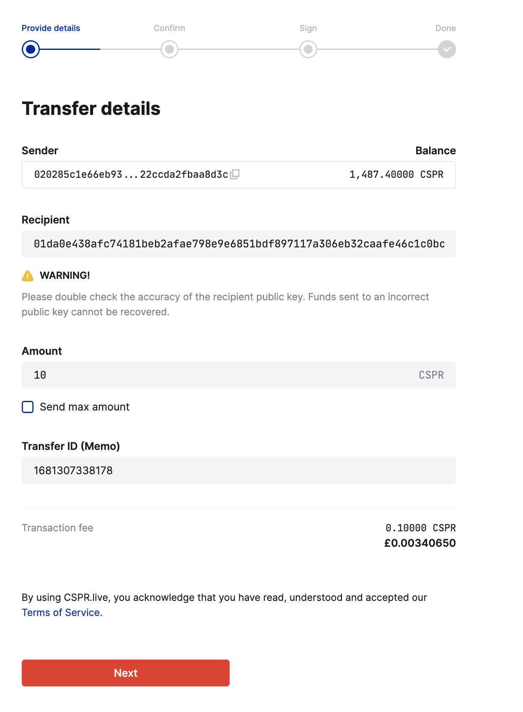
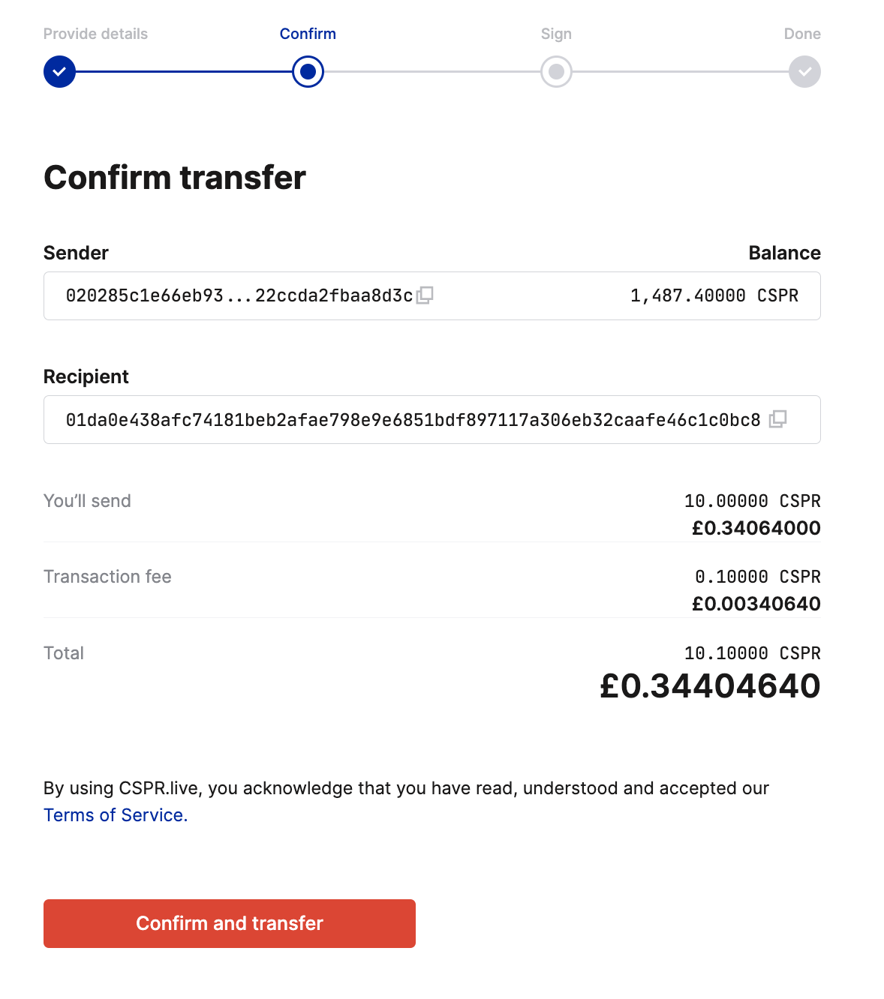
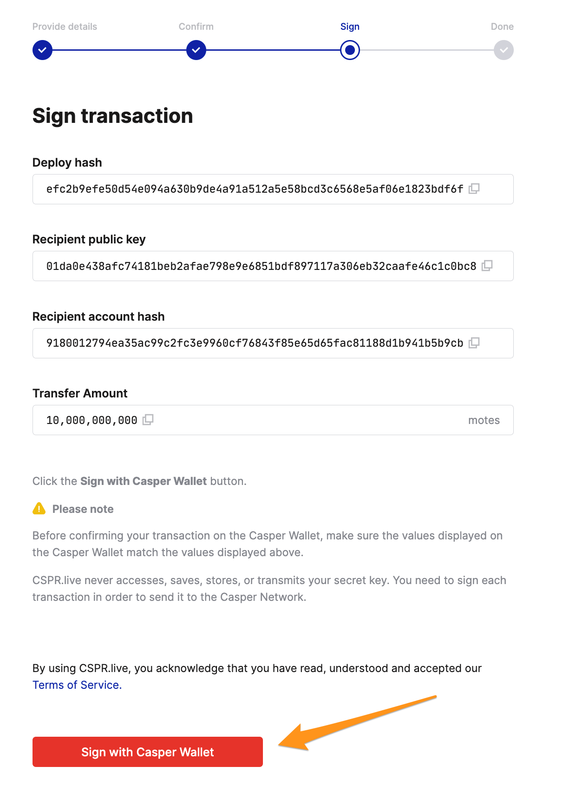
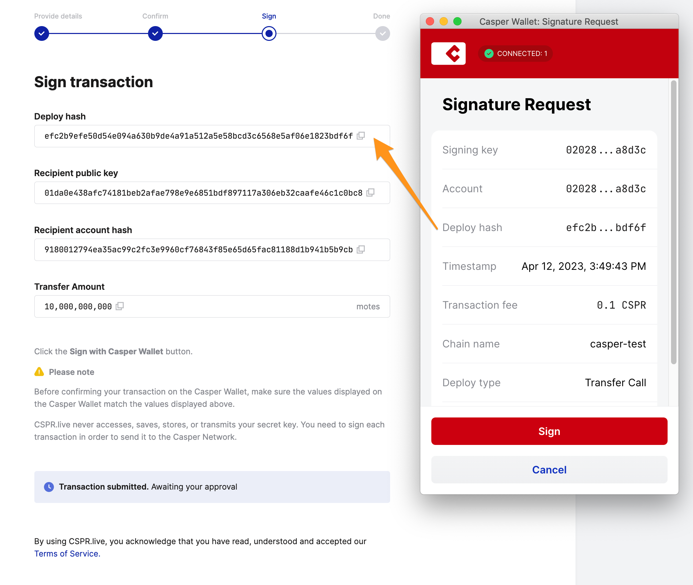
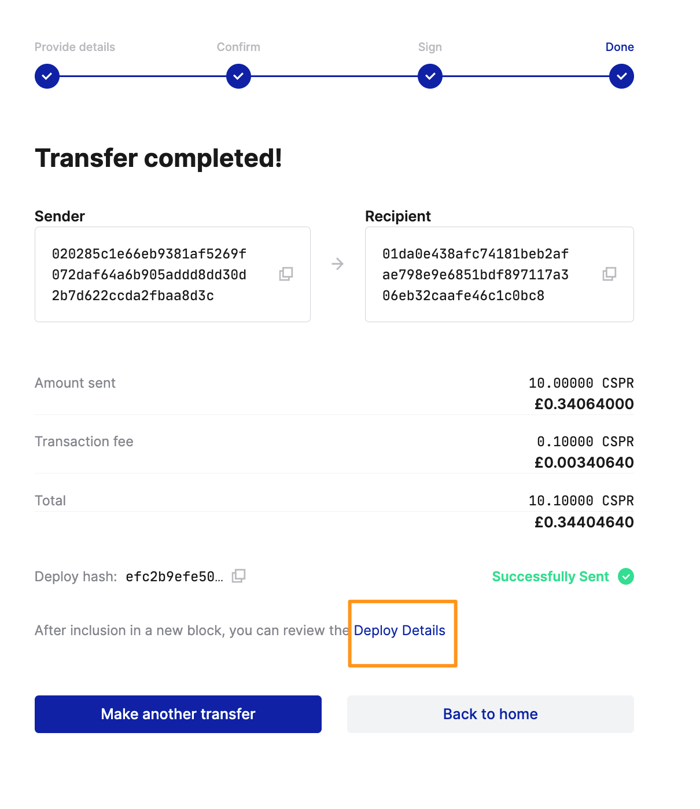

# Transferring Tokens

You can transfer Casper tokens (CSPR) using any [block explorer](../block-explorer.md) built to explore the Casper blockchain. The Wallet feature on these block explorers enables transfers to another user's purse, delegate stake, or undelegate stake. In this section, we will discuss the steps to transfer CSPR tokens.

## Transferring Tokens 

To transfer tokens, follow these steps:

1. Sign in to your account with the [Casper Wallet](https://www.casperwallet.io/). See the [Getting Started](https://www.casperwallet.io/user-guide/getting-started) user guide for detailed instructions.
2. Click **Wallet** on the top menu bar and select **Transfer CSPR** from the drop-down menu. 
3. Enter the recipient's public key, the amount you wish to transfer, and an optional Transfer ID for reference. If you do not provide an ID, the system will auto-generate one.
4. Click **Next** to proceed.

5. A confirmation window appears to verify the details entered. Click **Confirm and transfer** to proceed to the next step.

6. Review the following important fields:

- The Deploy hash, which uniquely identifies your transfer
- The Recipient public key of the person receiving your transfer
- The Recipient account hash used by the system to track the transaction
- The Transfer Amount containing the value of the transfer

Sign the transaction by selecting the **Sign with Casper Wallet** button to proceed to the next step. 

7. Once the Casper Wallet opens, **check the deploy hash**. Ensure the deploy hash in the "Signature Request" window matches the deploy hash in the "Sign transaction" window before continuing. Click **Sign** in the Signature Request window to complete the transaction.

8. You completed the transaction and successfully transferred tokens.

9. View the updated CSPR balance in the account's main purse next.
