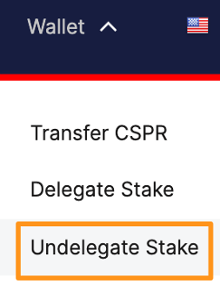
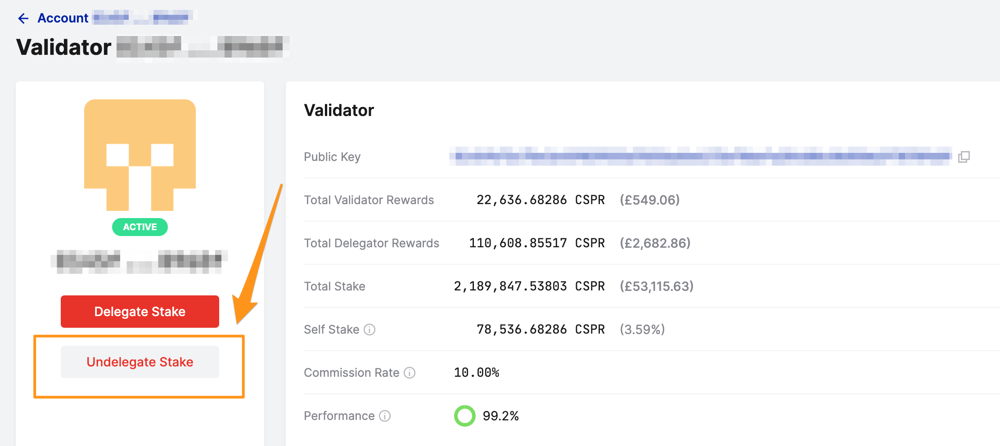
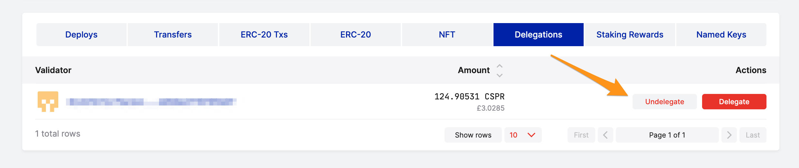
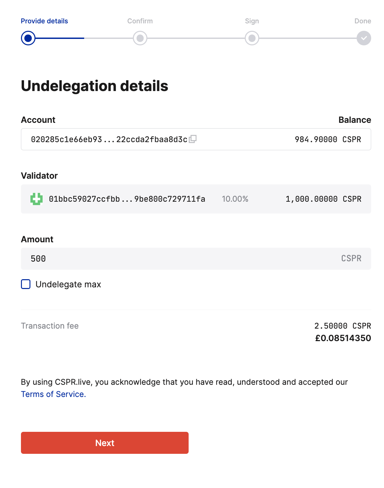
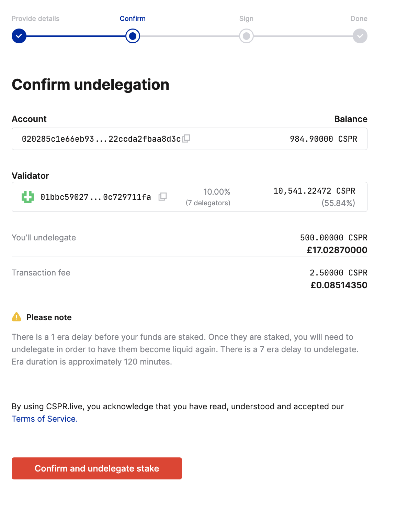
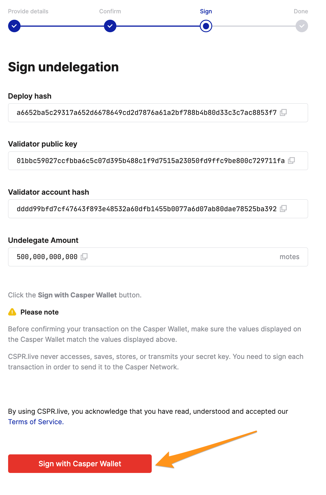
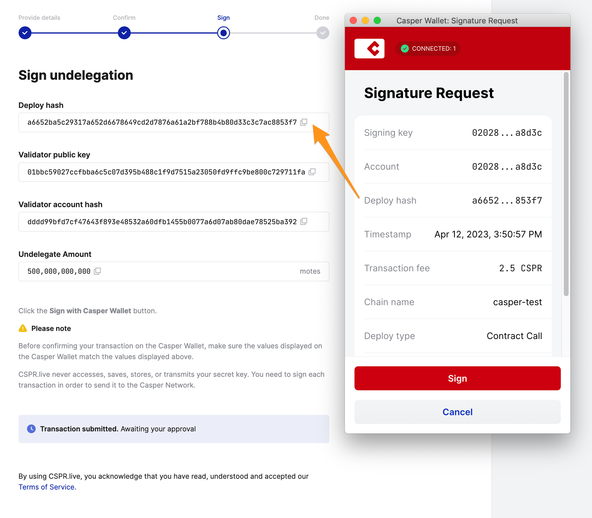
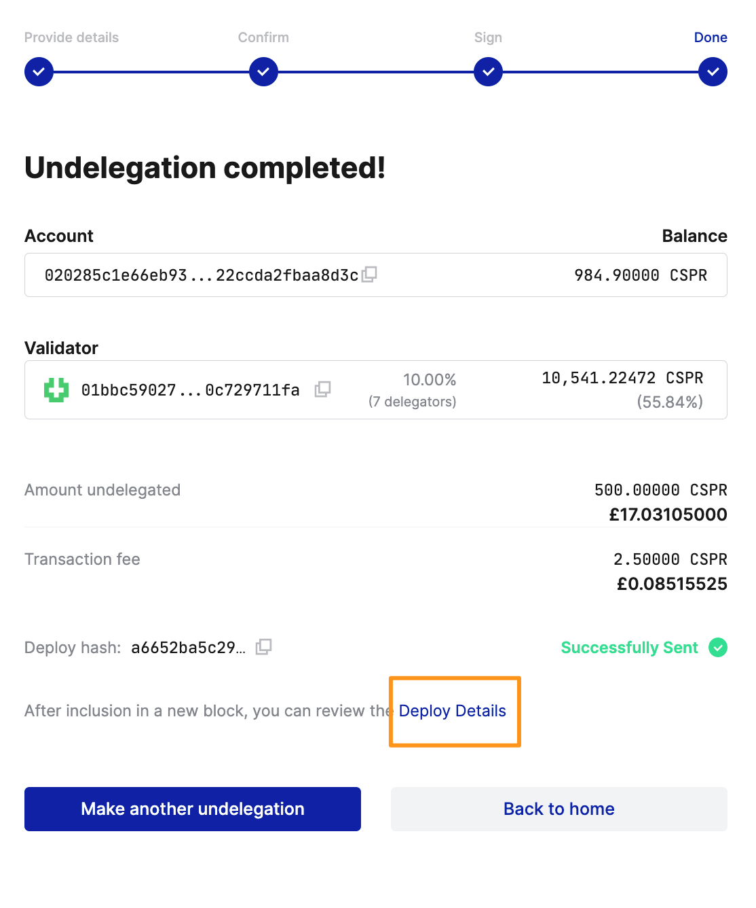

# Undelegating Tokens

If you want to undelegate tokens from a validator, you can do so at any time. Note that undelegation costs approximately 0.5 CSPR. 

## Prerequisites 

This guide assumes that you have previously delegated tokens to a validator using a [block explorer](./delegate-ui.md) or the [Casper client](../../developers/cli/delegate.md).

## Accessing the Undelegation Feature

You can access the undelegation functionality in three ways.

**Option 1:** Click **Wallet** from the top navigation menu and then click **Undelegate Stake**.

**Option 2:** Click **Validators** from the top navigation menu. Using the validators table, find the validator you wish to undelegate from, and click the **Undelegate Stake** button.

**Option 3:** Open your account details and select the **Delegations** tab. Click the **Undelegate** button next to the validator from whom you wish to undelegate.

## Stepping through the Undelegation Process

The following instructions will take you through the undelegation process, starting with the "Undelegation details" screen.

**Step 1 - Undelegation details**

1.  Specify the validator from whom you want to undelegate your tokens if you have reached this screen using the Wallet drop-down menu. The search box will automatically show you the validators with whom you have staked. Otherwise, verify the pre-populated key in the Validator field.
2.  Enter the amount of Casper tokens you want to undelegate.
3.  Click **Next**.

**Step 2 - Confirm the undelegation**

1.  Review the undelegation details.
2.  If everything looks correct, click **Confirm and undelegate stake**. If you wish to make changes, return to the previous screen.

**Step 3 - Sign the undelegation**

1.  Click **Sign with Casper Wallet** to sign the undelegation.

2.  Once the Casper Wallet opens, **check the deploy hash**. Ensure the deploy hash in the "Signature Request" window matches the deploy hash in the "Sign undelegation" window before continuing.

3.  Click **Sign** in the Signature Request window to finalize the undelegation. The stake undelegation initiates as soon as the corresponding deploy is signed. Here is the expected output:

It may take 1-2 minutes for the undelegation details to become available. Click "Deploy Details" for more information. 

Note that your undelegated tokens will appear in your account automatically after a 7-era delay of approximately 14 hours.

