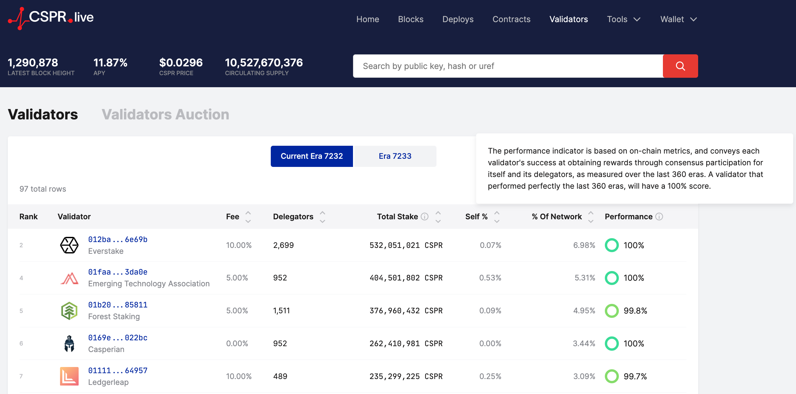
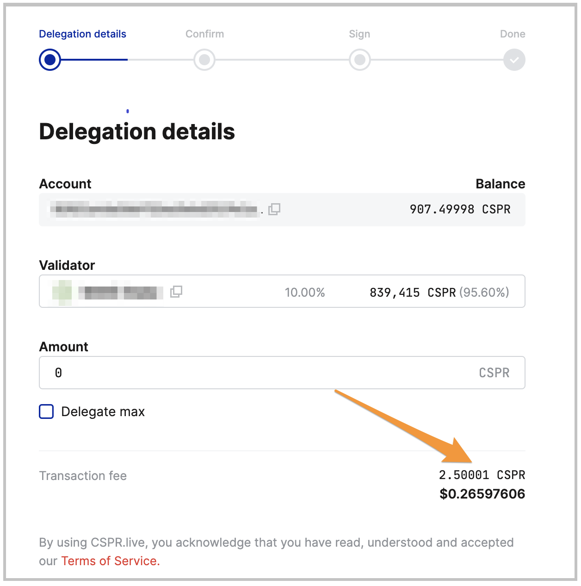

# Delegating Tokens

A feature of Proof-of-Stake protocols is that token holders can actively participate in the protocol through a mechanism known as **delegating** or **staking** with a validator. CSPR holders can stake their tokens with any validator on a Casper network. Alternatively, it is possible to stake tokens via an exchange or custody provider.

Node operators stake their tokens to earn eligibility to propose and approve blocks on the network. They also run and maintain servers connected to the network. If they win a validator slot, they become validators and help enable the Proof-of-Stake aspect of the network, a process different from mining tokens. Validators thus earn rewards for participating and for securing the network.

Anyone can participate in the protocol to earn rewards without maintaining a Casper node (a server that stores a copy of the blockchain). One can delegate or allocate CSPR tokens to a chosen validator on the network. Validators retain a percentage of the rewards generated from staked tokens. Participating in the protocol this way, the community can help improve the network's decentralization and security and earn rewards in return. Block explorers connected to the network usually post the base annual reward rate.

Casper does not treat validator stake differently than delegator stake for security reasons.

## Delegation Cost

This section provides a detailed explanation of the delegation cost mechanism, how the gas cost relates to delegations, and where to find more details. Please note that the cost amounts are likely to change over time, and you may have to check the latest release details to get the most up-to-date and accurate delegation cost.

The delegation cost is defined in the chainspec.toml file of a Casper network. In this [example chainspec](https://github.com/casper-network/casper-node/blob/release-2.0.0-rc1/resources/production/chainspec.toml), the delegation is set to cost 2.5 CSPR. However, `when you perform the delegation, you see that it costs a little more` than what is specified in the chainspec. Let's discuss why this happens.

When you delegate, the system automatically charges some gas to set up related data in the global state of the network to track your delegation. This cost is added to the delegation cost defined in the chainspec file. Ensure you have extra CSPR in your account's main purse apart from the amount you are delegating; otherwise, the transaction will fail. For example, if you want to delegate 1000 CSPR, you need to have at least 1003 CSPR in your account's main purse.

For example, the chainspec file in release 2.0.0 contains the following information. Notice the delegation cost specified with `delegate`.

```toml
[system_costs.auction_costs]
...
delegate = 2_500_000_000
undelegate = 2_500_000_000
...
```

Delegation fees may change over time, so it is essential to stay current. To do so, select the latest release in [Github](https://github.com/casper-network/casper-node) and navigate to the `resources/production/chainspec.toml` file.

For further questions, please join the [Discord channel](https://discord.com/invite/casperblockchain).

## Delegation Limits

The chainspec specifies delegation limits, such as the minimum and maximum amount allowed to be delegated. Also, each validator can have a maximum number of delegators.

```toml
# Minimum allowed delegation amount in motes
minimum_delegation_amount = 500_000_000_000
# Maximum allowed delegation amount in motes
maximum_delegation_amount = 1_000_000_000_000_000_000
# The maximum amount of delegators per validator.
max_delegators_per_validator = 1200
```

## Selecting a Node for Delegating {#selecting-a-node-for-delegating}

As a prospective delegator, it is essential to select a validating node that you can trust. Block explorers such as [cspr.live](https://cspr.live) provide [validator performance statistics](https://cspr.live/validators), including a performance score, total stake, number of delegators, and fees. Please do your due diligence before staking tokens with a validator.

 

## First-time Delegation

If you perform a delegation for the first time, the system charges some motes to create a purse to hold the delegated tokens. We recommend that you try out delegations on the [Casper Testnet](https://testnet.cspr.live/) before making transactions on the [Casper Mainnet](https://cspr.live/). This will help you understand the costs involved in delegating tokens.

**Example:** The system can charge 0.5 CSPR in addition to the base delegation fee of 2.5 CSPR, resulting in a delegation cost of 3 CSPR on [Mainnet](https://cspr.live/).

When you set up a delegation transaction, it is essential to have enough funds in your account's main purse. Otherwise, the transaction will fail, and you will lose the delegation cost. For example, if you have 200 CSPR in your purse, delegate at most 197 CSPR and leave at least 3 CSPR for the delegation cost. Another option is to delegate 195 CSPR and leave some additional buffer.

As a result, when performing a [delegation using the command line](../developers/cli/delegate.md), we recommend you specify a little more than the base transaction payment to ensure that the transaction will go through without failure.


<p align="center">
**Figure 2** : On Testnet or Mainnet, the transaction fee for a delegation is a little bit higher than 2.5 CSPR.
</p>

:::note

Transaction costs depend on each Casper network and the cost tables defined in the chainspec. Most of these examples are from the Casper Mainnet or Testnet.

:::

## Monitoring Rewards {#monitoring-rewards}

It's recommended that you check in on how your stake is performing from time to time. If the validator you staked with decides to unbond, your stake will also be unbonded and you will not earn rewards. Ensure that the validator you selected performs as per your expectations.

Validators have to win a staking auction by competing for a validator slot with prospective and current validators. This process is permissionless, meaning validators can join and leave the auction without restrictions, except for the unbonding wait period, which lasts 14 hours.

## Tutorials

Navigate to these pages for step-by-step tutorials on delegating and undelegating tokens.

- [Delegating tokens using a block explorer](./csprlive/delegate-ui.md)
- [Delegating with Ledger devices](./ledger/staking-ledger.md)
- [Delegating with the Casper client](../developers/cli/delegate.md)
- [Undelegating tokens using a block explorer](./csprlive/undelegate-ui.md)
