# Using Ledger and CSPR.live

This guide will help you connect your Ledger device to a Casper account using the [cspr.live](https://cspr.live/) block explorer to send and receive CSPR tokens.

## Prerequisites

1. Install a Chromium-based browser, such as Chrome or Brave, for use with [cspr.live](https://cspr.live/) for the Casper Mainnet.

## Signing In {#sign-in}

To use the Ledger device with the [cspr.live](https://cspr.live/) block explorer, follow these steps:

1. Connect the Ledger device to your computer and unlock it by entering your device PIN.
2. Open the Casper app on the Ledger device as shown above.
3. While keeping the Casper app open, navigate to [cspr.live/sign-in](https://cspr.live/sign-in).

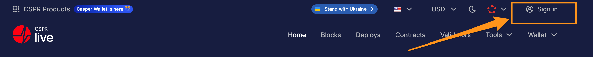

4. Click on the **Connect** button in the Ledger section.

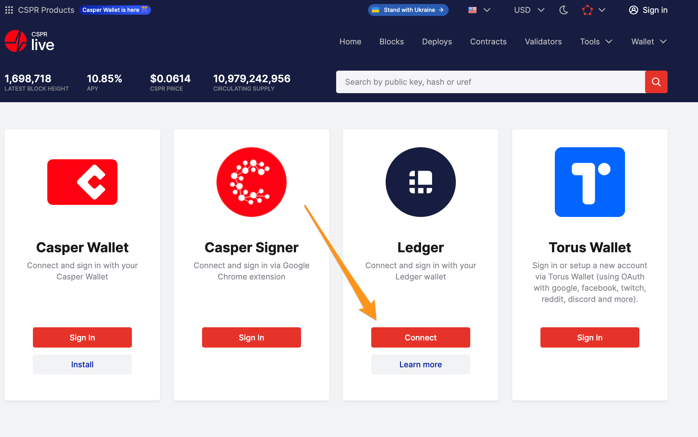

5. Click the **Connect to Ledger wallet** button next.

6. Select an account you want to use.

7. Your Ledger device is now connected to the block explorer, displaying your account details.

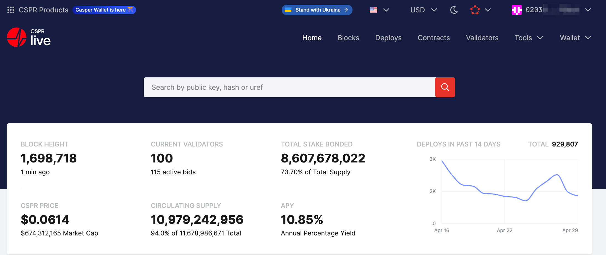

## Viewing Account Details {#view-account-details}

1. Open [cspr.live](https://cspr.live).
2. Click on the account in the upper-right corner of the page.

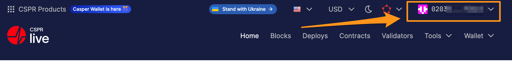

3.  Click on the **View Account** button.

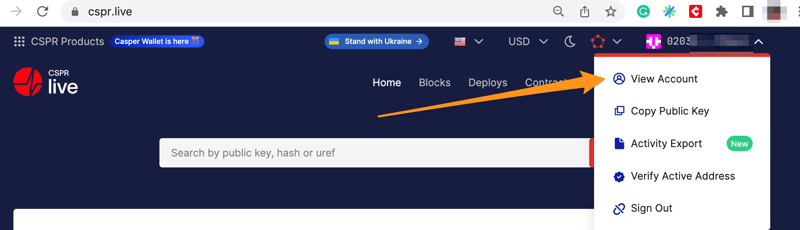

4. You are presented with a page displaying details about your account. Check your account's main purse balance in the **Liquid** row under **Total Balance**.

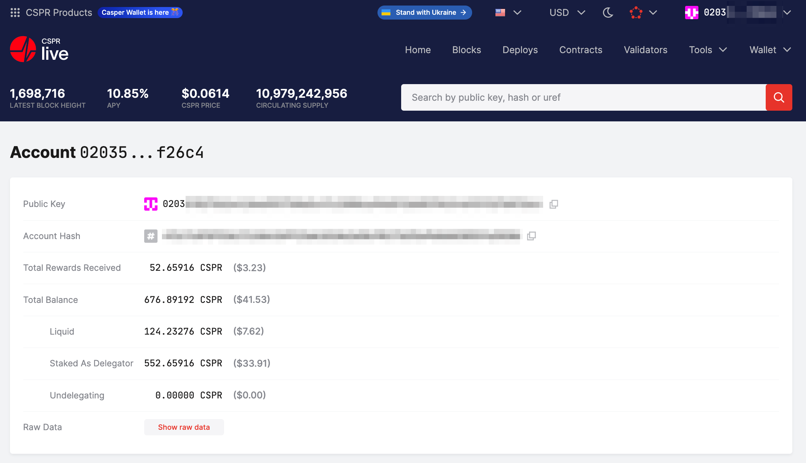

## Receiving Tokens {#receive-tokens}

To receive tokens, you need to provide the sender with your account's public key. To find it, follow these steps:

1. Open the account details page as described [here](#view-account-details) and copy the public key in the **Public Key** row.
2. Alternatively, click on the drop-down menu on your account address.

3. Click on the **Copy Public Key** button and share it with the sender.

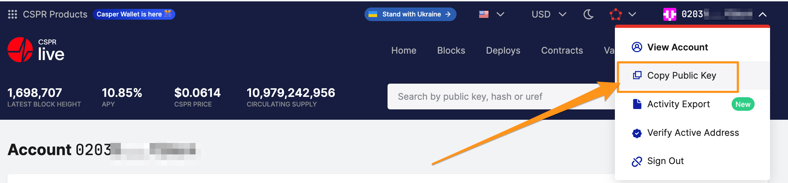

## Sending Tokens {#send-tokens}

1. Open [cspr.live](https://cspr.live).
2. Sign in with your Ledger device.
3. Click on **Wallet** and then **Transfer CSPR**.

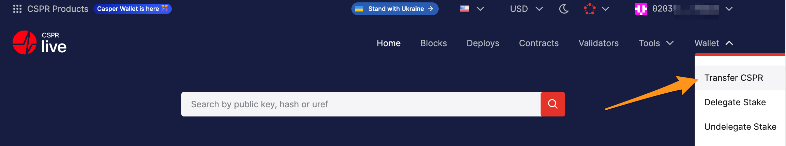

4. Fill in the details for the transfer.

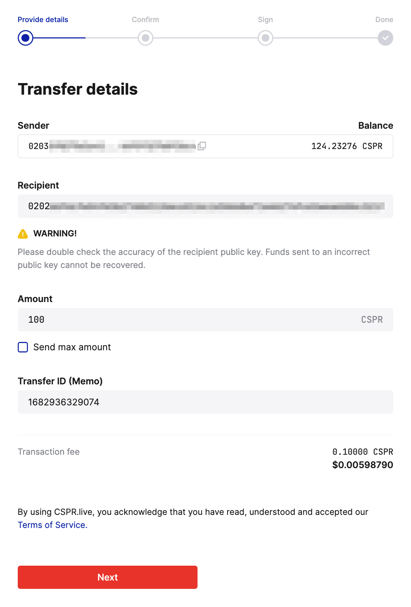

5. Click on the **Next** button.
6. On the next page, click **Confirm and transfer**.

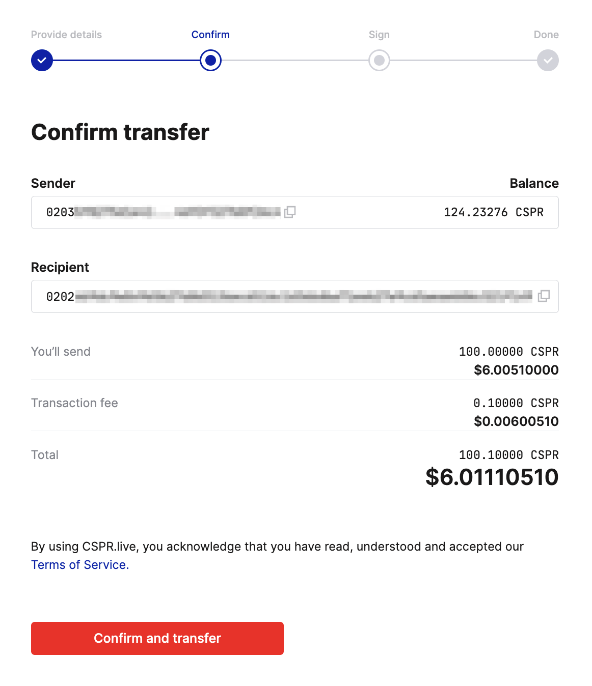

7.  On the **Sign transaction** page, click on the **Sign with Ledger** button.

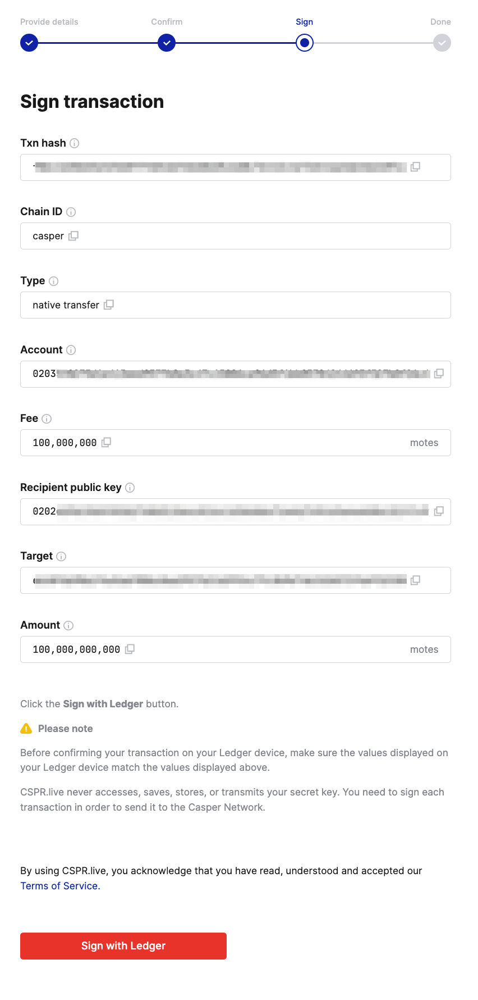

8. Your Ledger hardware wallet will present you with transfer details. Verify the transfer details (txn hash, chain ID, source **account**, fee, target, and amount). Meanwhile, the block explorer will show this message:

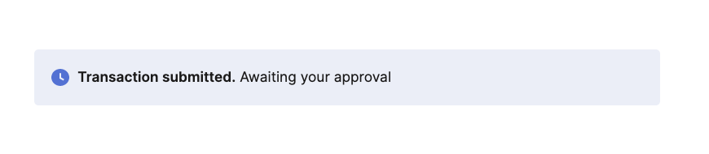

**Verify the transaction on your Ledger device**

Press the right button on your Ledger Device to review the transaction details (Amount and Address) until you see **"Approve"**.

1. Verify the **Txn hash** - ensure it matches the value displayed on [cspr.live](https://cspr.live).

The Txn hash value continues on a second screen.

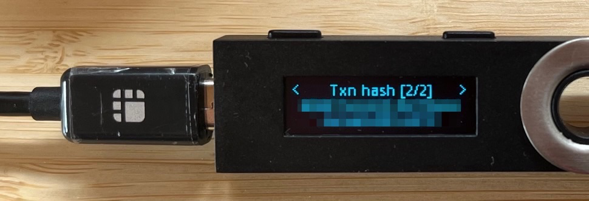

2.  The next page displays transaction **Type** - for CSPR transfers, that will be **Token transfer**.

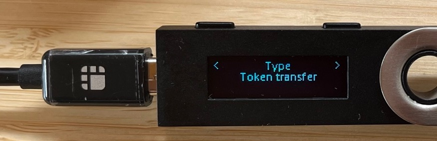

3. Verify the **Chain ID**, which identifies the network to which you want to send the transaction.

4. Verify the **Account**, the account's public key initiating the transaction.

The Account value continues on a second screen.

5. Verify the **Fee**. For CSPR token transfers, that value should be constant and equal to 100,000,000 motes = 0.1 CSPR.

6. Verify the **Target**, the recipient's public key. Compare this value with the one in the block explorer.

The Target value continues on a second screen.

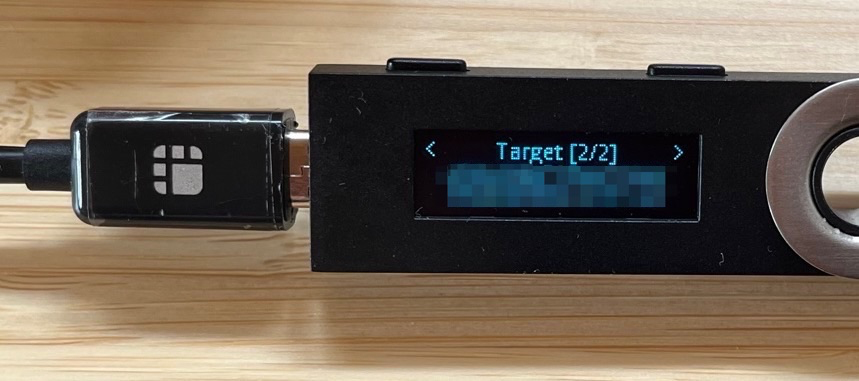

7.  Verify the **Amount** you want to transfer.

8. If you want to approve the transaction, click both buttons on the Ledger device while on the **APPROVE** screen.

After approving the transaction with your Ledger hardware wallet, the [cspr.live](https://cspr.live) block explorer will display a "Transfer completed" page.

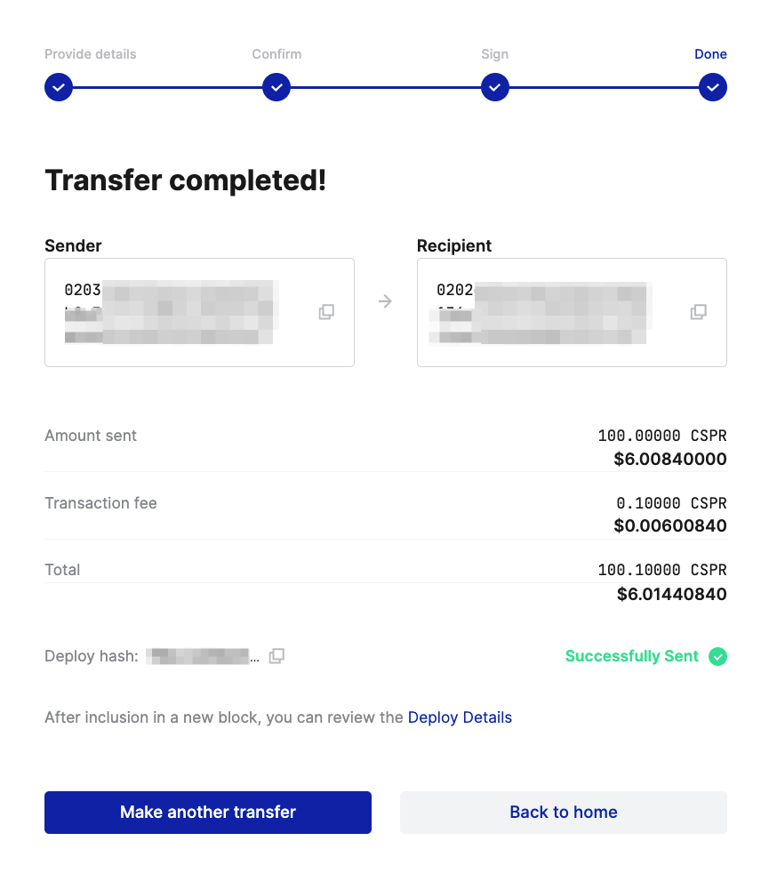

You can now check your account to see a list of all the completed transfers.
