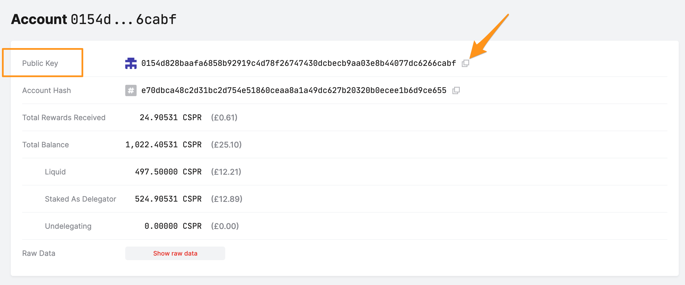
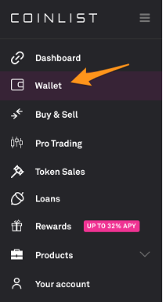
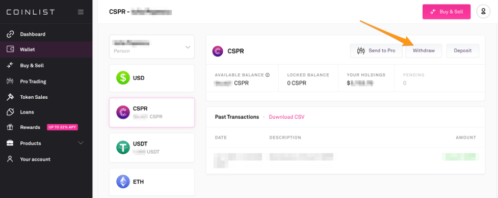
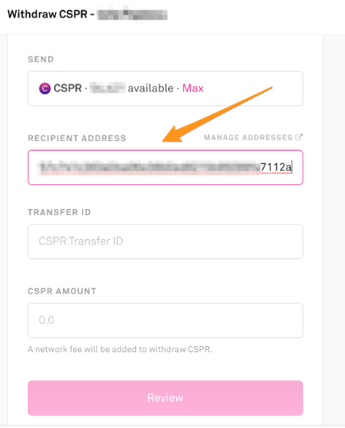

# Funding Mainnet Accounts from an Exchange

To send CSPR tokens from an exchange to a Mainnet account, you need the **Mainnet account's public key**. Then, you can set up a withdrawal request from the exchange using this public key. The transfer will take a few minutes. 

This guide demonstrates a withdrawal from [Coinlist](https://coinlist.co/) to the Casper Mainnet using the [cspr.live](https://cspr.live/) block explorer. You need to contact the exchange for instructions if you are working with a different exchange.

## Prerequisites

Before starting, copy the public key where you wish to transfer funds. The screenshot below shows the account page on [cspr.live](https://cspr.live/) and the field you need to specify in the withdrawal request from Coinlist.

 

## Transfers from Coinlist to Casper Mainnet

Try these steps with a small amount of CSPR first. After one successful transfer, you will be more comfortable transferring larger amounts.

1. Log into your [https://coinlist.co/](https://coinlist.co/) account.
2. Go to the "Wallet" tab.

3. Click on the "CSPR" section.

4. Click on the "Withdraw" button.

5. Enter the public key of the Mainnet account in the "Recipient Address" field of the withdrawal request.

6. Enter 0 in the "Transfer ID" field or another value that is meaningful to you. **You MUST enter a value, or the transfer will fail!**

7. Enter the CSPR amount you wish to transfer.

8. Click "Review".

9. Submit the transfer request. Wait approximately 5 minutes, and then go to the [cspr.live](https://cspr.live/) site to verify your account details. On the account page, you should see that the "Liquid Account Balance" reflects the amount you have transferred.

